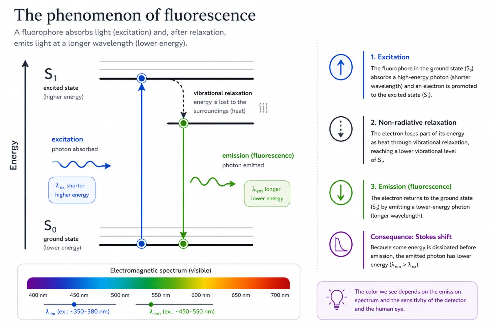

# Fluorescence — Phenomenon, Fluorophores, and Spectra

## Learning objectives

By the end of this lesson, you should be able to:

- explain the physical phenomenon of fluorescence and its relationship to light–matter interactions;
- explain why fluorescence emission occurs at longer wavelengths than excitation;
- distinguish the main fluorescent labeling strategies and their experimental implications;
- interpret excitation and emission spectra, including the Stokes shift;
- use spectral reference tools to evaluate fluorophores relevant to your experiment.

## 1. Fluorescence and the transformation of bioimaging

Fluorescence microscopy has profoundly transformed modern cell biology. The ability to label specific cellular structures, monitor dynamic processes, and quantify signals at scale has shifted microscopy from a primarily descriptive discipline to a quantitative one. This transition was fundamental to the emergence of High Content Analysis (HCA).

In the early 2000s, advances in microscope automation, together with increasing computational power and the development of quantitative image analysis methods, enabled large-scale imaging experiments. Initially, many of these assays were associated with high-throughput drug screening. However, it soon became clear that cellular images contained far more information than fluorescence intensity measurements or the presence or absence of a specific marker.

Morphological and phenotypic analysis then became central to biological discovery. Subtle changes in cell shape, texture, intracellular organization, and organelle distribution began to be used to infer complex biological states. This expanded the applications of fluorescence microscopy to drug discovery, toxicology, systems biology, genetic perturbation studies, and mechanistic research.

Fluorescence microscopy became particularly important in this context because it produces images with a high signal-to-noise ratio. Unlike conventional brightfield microscopy, the fluorescent signal originates predominantly from the labeled molecules, increasing image contrast and facilitating segmentation, quantification, and computational analysis. As discussed in Lesson 1, an image with high contrast and a good signal-to-noise ratio is far more suitable for quantitative analysis than an image that is visually appealing but exhibits poor separation between signal and background.

Another major advantage of fluorescence microscopy is the wide variety of available labeling strategies. Researchers can use fluorescently conjugated antibodies, fluorescent small molecules, physiological sensors, genetically encoded fluorescent proteins, or fluorogenic enzyme substrates. These tools make it possible to monitor everything from cellular structures to functional states such as membrane potential, viability, intracellular pH, and metabolic activity.

An equally important feature is the ability to perform multiplexed imaging. Different fluorophores can be used simultaneously because they absorb and emit light at different regions of the electromagnetic spectrum. This allows multiple cellular processes to be observed within the same sample, a capability that is essential for many HCA assays.

!!! info "Fluorescence as a biological signal converter"
    In HCA, fluorescence is much more than a way to **visualize cells**. It is a mechanism for converting biological states into quantitative data that can be analyzed computationally. The choice of fluorophore, imaging channel, and acquisition parameters directly determines the quality and interpretability of the resulting data.

!!! tip "Before moving on"
    - Why does fluorescence microscopy typically produce images with a higher signal-to-noise ratio than brightfield microscopy?
    - Why is multiplexing particularly valuable in HCA experiments?

## 2. The phenomenon of fluorescence

To understand fluorescence microscopy, we must first understand how light interacts with matter. In Lesson 1, we discussed that light exhibits wave–particle duality and can be described both as an electromagnetic wave and as a stream of particles. These particles are called **photons**, each carrying a discrete amount of energy.

The energy of a photon depends on its wavelength: shorter wavelengths correspond to higher energies. As a result, ultraviolet light is more energetic than green light, which in turn is more energetic than red light. This relationship between wavelength and energy is fundamental to understanding why fluorescence necessarily involves a change in wavelength between excitation and emission.

When a molecule absorbs light, several physical processes may occur. In many cases, the absorbed energy is dissipated through molecular motion and vibrational relaxation, ultimately producing heat. This process is particularly important in the infrared region of the electromagnetic spectrum, where photon energy is converted predominantly into thermal energy.

In fluorophores, however, part of the absorbed energy promotes electrons from the ground electronic state to higher-energy excited states. This transition occurs on extremely short timescales and is commonly represented using a **Jablonski diagram**.

$$
S_0 \rightarrow S_1
$$

After excitation, the electron loses part of its energy through vibrational relaxation before returning to the ground state. When this return is accompanied by the emission of a photon, the process is called **fluorescence**. Because some of the absorbed energy has already been dissipated before emission, the emitted photon carries less energy than the absorbed photon. Consequently, fluorescence emission always occurs at a longer wavelength than excitation.

$$
\lambda_{em} > \lambda_{ex}
$$

This difference between excitation and emission is fundamental to fluorescence microscopy. It allows optical filters to separate the excitation light illuminating the sample from the fluorescence emitted by the fluorophore—a topic that we will examine in detail in the next lesson.

!!! warning "A common misconception"
    A fluorophore does **not** "change color" after excitation. Instead, it emits lower-energy photons because part of the absorbed energy is lost during vibrational relaxation. The difference in color between excitation and emission is a consequence of fundamental physical principles, not of a chemical transformation of the molecule.

!!! tip "Before moving on"
    - If a fluorophore is excited with blue light, why can't it emit blue light as well?
    - What is the practical consequence of the relationship $\lambda_{em} > \lambda_{ex}$ for the design of a fluorescence microscope?

## 3. Fluorophores and labeling strategies

Fluorophores used in microscopy can be classified into several categories. Although they all operate according to the same physical principle—light absorption followed by photon emission—they differ in how they recognize cellular structures and in the biological information they provide. Understanding these differences is essential for selecting the labeling strategy that best addresses your experimental question.

Fluorescent immunoreagents use antibodies directly conjugated to fluorophores or primary/secondary antibody systems. This approach provides high molecular specificity and is widely used in immunofluorescence. However, it generally requires cell fixation and permeabilization, as well as careful experimental optimization to minimize nonspecific staining. As a result, it is better suited for endpoint assays than for live-cell experiments.

Fluorescent small-molecule probes represent an extremely diverse class of labels. Many exhibit chemical affinity for specific organelles or cellular states. Examples include DNA dyes such as Hoechst 33342, lysosomal probes, membrane potential indicators, and pH-sensitive dyes. Their main advantages are ease of use and compatibility with live-cell imaging, although they are often less specific than antibody-based approaches.

Fluorescent proteins constitute another major labeling strategy. Originally derived from GFP, which was first isolated from *Aequorea victoria*, these proteins can be genetically expressed in living cells, allowing biological processes to be monitored over time. The development of fluorescent proteins revolutionized cell biology by making it possible to visualize specific proteins in living cells without fixation. This pioneering work earned Osamu Shimomura, Martin Chalfie, and Roger Tsien the 2008 Nobel Prize in Chemistry.

From an experimental perspective, no fluorophore is universally superior. The optimal choice depends on the biological question, the available optical system, the sample type, and the experimental design. In HCA, this decision is even more critical because the fluorophore determines not only what can be visualized, but also the quality of the quantitative data that can ultimately be extracted.

!!! tip "Before moving on"
    - Which labeling strategy would be most appropriate for monitoring the dynamics of a protein in living cells over time?
    - Why is immunofluorescence generally unsuitable for live-cell experiments?

## 4. Excitation and emission spectra

The spectral properties of fluorophores are typically represented by **excitation** and **emission spectra**. These plots describe the relative probability of light absorption and fluorescence emission across different wavelengths. Learning how to interpret them is essential for selecting appropriate light sources, optical filters, and compatible fluorophore combinations.

The X-axis typically represents wavelength (in nanometers), whereas the Y-axis represents the relative excitation or emission efficiency. The peaks of these curves correspond to the wavelengths at which excitation or emission is most efficient and are commonly denoted as:

$$
\lambda_{ex} \quad \text{and} \quad \lambda_{em}
$$

The difference between the excitation and emission maxima is known as the **Stokes shift**. This parameter is critically important because it determines how easily the optical system can separate excitation light from fluorescence emission.

$$
\Delta\lambda = \lambda_{em} - \lambda_{ex}
$$

In general, a larger Stokes shift makes optical separation between excitation and emission easier. This reduces spectral overlap and improves the signal-to-noise ratio, both of which directly influence the quality of quantitative data in HCA.

It is important to remember that fluorophores do not emit light at a single wavelength. Instead, they produce relatively broad emission spectra. As a result, a "green" fluorophore may still emit a portion of its fluorescence in the yellow or even red regions of the spectrum. This spectral bandwidth has important implications for multiplexed imaging, as we will discuss in the next lesson.

!!! tip "Color names are simplifications"
    In fluorescence microscopy, terms such as "green," "red," or "blue" are convenient shorthand for communication. In reality, fluorophores always exhibit continuous excitation and emission spectra. Experimental decisions should therefore be based on spectral data rather than color names.

!!! tip "Before moving on"
    - If two fluorophores have the same $\lambda_{em}$ but different Stokes shifts, which one is likely to be easier to separate optically from the excitation light?
    - Why can a "green" fluorophore generate signal in the detection channel of a "yellow" fluorophore?

## 5. Exploring fluorescence spectra with FPbase

To better understand these concepts, we will use **FPbase**, a free online resource developed by Talley Lambert and collaborators. The platform integrates spectral data for fluorophores, optical filters, lasers, and microscope systems, allowing users to visualize and compare spectral properties interactively.

The **Spectra Viewer** enables excitation and emission spectra to be displayed simultaneously. This makes it an invaluable tool for evaluating the compatibility between fluorophores, optical filters, and excitation sources—information that will become essential when we discuss spectral channel selection and panel design in the next lesson.

In this activity, we will use **Hoechst 33342** as an example. This fluorophore is widely used as a nuclear stain because of its affinity for DNA.

!!! example "Activity: Exploring Hoechst 33342 with FPbase"
    Open the Spectra Viewer at:

    https://www.fpbase.org/spectra/

    Under the **FLUOROPHORES** menu, select **Hoechst 33342** and examine how its excitation and emission spectra occupy distinct regions of the visible spectrum.

    Consider the following questions:

    - At which wavelength does excitation reach its maximum?
    - At which wavelength does emission reach its maximum?
    - What is the approximate Stokes shift?
    - In which spectral region does most of the fluorescence emission occur?
    - Which excitation wavelength would be more efficient: **325 nm** or **350 nm**?

    As you explore the spectra, relate the fluorophore's behavior to the physical principles discussed in this lesson.

!!! tip "Before moving on"
    - Does the emission spectrum of Hoechst 33342 consist of a single wavelength or a broad spectral band? What are the implications for filter selection?
    - If you needed to add a second fluorophore to the same experiment, which spectral region would you avoid to minimize overlap with Hoechst?

## 6. Summary

In this lesson, we learned that fluorescence is a physical phenomenon in which a molecule absorbs light and subsequently emits a lower-energy photon, resulting in fluorescence emission at a longer wavelength than the excitation light. This property, known as the **Stokes shift**, forms the physical basis for separating excitation light from fluorescence emission in a microscope.

We also discussed that fluorophores are not interchangeable. Different labeling strategies—including fluorescent immunoreagents, small-molecule probes, and fluorescent proteins—offer distinct advantages and limitations. Selecting the most appropriate strategy therefore depends on the biological question, the experimental design, and the imaging system available.

Finally, we learned how to interpret excitation and emission spectra and used FPbase to explore these properties interactively. This conceptual foundation will be essential for the next lesson, where we will examine how the optical system—including excitation filters, dichroic mirrors, emission filters, and detectors—transforms fluorescence into the image channels used for quantitative High Content Analysis.

### Exercises

1. Explain why fluorescence emission necessarily occurs at longer wavelengths than excitation. Relate your answer to the concept of vibrational relaxation.

2. Compare the general absorption of light by molecules (energy dissipation as heat) with fluorescence (photon emission). Why is not every light-absorbing molecule a fluorophore?

3. A researcher needs to monitor the subcellular localization of a protein of interest in living cells over a period of 24 hours. Which labeling strategy would be most appropriate? Justify your answer.

4. Using FPbase, compare the excitation and emission spectra of **Hoechst 33342** and **GFP**. Determine the approximate Stokes shift for each fluorophore and discuss the challenges that might arise when using them in the same experiment.

5. A colleague claims that "green fluorophores emit only green light." Based on the concepts of spectral bandwidth discussed in this lesson, do you agree? Explain your reasoning.

### Further reading

- [FPbase](https://www.fpbase.org/) — Interactive database of fluorophore spectra, optical filters, and microscope systems.
- [Microtutor](https://microtutorcourses.org/) — *Fluorescence Microscopy*
- [iBiology](https://www.ibiology.org/talks/fluorescence-microscopy/) — *Introduction to Fluorescence Microscopy*
- [Ogama T (2020) *A Beginner's Guide to Improving Image Acquisition in Fluorescence Microscopy*](https://doi.org/10.1042/bio20200075). *The Biochemist* **42**, 22–27.
- [Lichtman JW, Conchello J-A (2005) *Fluorescence Microscopy*](https://doi.org/10.1038/nmeth817). *Nature Methods* **2**, 910–919.
