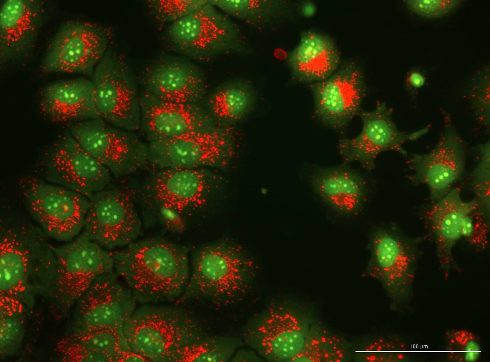

# Lesson 1 — The image as data

**By the end of the lesson, the learner should be able to:**

- recognize a digital image as a matrix of values;
- explain what a pixel represents in terms of position and intensity;
- distinguish pixel size, image dimensions, and spatial resolution;
- distinguish an RGB image from a multichannel fluorescence image;
- interpret bit depth and value range;
- read a simple intensity histogram;
- distinguish image data from the way they are displayed;
- recognize that LUTs, brightness, and contrast can alter visualization without necessarily altering pixel values;
- identify operations that modify only the display and operations that modify the data;
- become familiar with basic image analysis options using Fiji.

## Guiding question

> Do you know what actually exists inside an image file?

## 1. Before we begin: what do you see when you look at an image?

Human beings are highly visual. We depend heavily on vision and, as a result, tend to trust what we see.

Some limitations of this characteristic will be discussed later, especially when we talk about ethics and image interpretation. For now, let us use our vision to evaluate the image below.



When we look at an image like this, depending on our experience, even without knowing exactly what is being labeled, we may make an assessment like this:

> “The cells are attached to the substrate, with confluence between 70% and 80%. The nuclei are clearly labeled in green, the nucleoli appear more evident, and in the cytoplasm I can see structures that look like dots.”

Right?

But this is still an interpretation. It is an estimate made by our vision and processed by the brain.

In this course, we want to use images to perform quantitative analyses. To do that, we need to start asking other questions:

- Where is the image information stored?
- How does the computer “see” this image?
- What does a pixel value mean?
- Are colors part of the data or only part of how they are displayed?
- What happens when we resize, convert, or adjust an image?

We will answer these questions through practice.

## 2. An image is a matrix of values

Before discussing definitions, let us build a very simple image and look at what exists inside it.

For this activity, you will need:

- a text editor;
- Fiji installed;
- a folder in which to save the files produced during the tutorial.

Any text editor will work, from Notepad to `vi` or VS Code.

*Fiji is just ImageJ.* You could also use ImageJ if you already have it installed. The difference is that Fiji includes several useful plugins for working with bioimages.

!!! download "Activity files"

    Download the images used in this lesson:

    [Download Lesson 1 files](../../assets/lesson-1-image-as-data.zip){ .md-button .md-button--primary }

### Hands-on — Creating an image

#### Objective

To demonstrate concretely that an image can be created, read, edited, and reconstructed from numerical values.

#### Activity in Fiji

1. Create an image in `File > New > Image`.
2. Use the following settings:
   - give the image a name;
   - select `8-bit`;
   - fill it with black pixels;
   - use dimensions of `10 × 10` pixels;
   - keep `1 slice`.
3. Zoom in substantially so that you can see the pixels.
   - use the magnifying glass;
   - or use `Ctrl + +` on Windows/Linux and `Cmd + +` on macOS.
4. Double-click the `Pencil` tool.
5. Choose size `1`, corresponding to one pixel.
6. Choose white and draw something.
7. Repeat the procedure using gray.
8. Save the image using `File > Save As > Text Image`.
9. Open the saved file in a text editor.
10. Compare the values in the file with the drawing.
11. Manually change some values.
12. Save the file with a different name.
13. Import the modified image using `File > Import > Text Image`.
14. Compare the original image with the modified image.

### Questions to explore during the activity

- What changed when you drew in white?
- What value appeared in the text file?
- What changed when you drew in gray?
- Is the position of the number in the file related to the position of the pixel in the image?
- What happens when you modify a single value?
- Does the computer need to “see” the cell in order to work with the image?

### What can we conclude from the activity?

Looking at the text file, it becomes clear that the image is made of numbers. These numbers are organized into rows and columns. We call this organization a **matrix**.

We also saw that the values are not isolated. Each value occupies a specific position and corresponds to a position in the image. In other words, a digital image combines:

- a spatial organization;
- numerical values associated with each position.

If we think about a fluorescence microscopy image, these values represent, in a simplified way, the intensity recorded by the detector at each position.

!!! quote "Digital image"

    “An image can be defined as a light-intensity function, denoted by $f(x,y)$, whose value or amplitude at the spatial coordinates $(x,y)$ provides the intensity or brightness of the image at that point.”

    — Hélio Pedrini & William Schwartz (2008), *Análise de Imagens Digitais*

This brings us to the next concept. Each position in the matrix corresponds to a **pixel**.

A pixel is the smallest sampled unit of a digital image. It has a position and a value. However, it is important to be careful with the common simplification that a pixel is a little *square*.

A pixel is a sampled position in the image. What it represents biologically depends on the optics, detector, pixel size, focus, signal, noise, and several other acquisition steps.

## 3. Pixel, resolution, and sampling

Now that we know an image is a matrix of values, we can explore a very common question:

> If I increase the number of pixels in an image, am I creating more detail?

### Hands-on — Generating pixels

#### Objective

To explore the difference between magnifying the display, resizing the image, and actually acquiring more information.

#### Activity in Fiji

We will continue using the `10 × 10` pixel image.

1. Open the modified image.
2. View it at the highest possible zoom, for example `3200%`.
3. Duplicate the image using `Image > Duplicate`.
4. Resize the copy using `Image > Scale`.
5. First use `Interpolation: None`.
6. Save the copy with `_interpolation_none` in the file name.
7. Repeat the conversion and saving procedure using:
   - `Bilinear`;
   - `Bicubic`.
8. Compare the original image with the resized images.
9. Observe the edges and pixel values.
10. Repeat the procedure using a real image (e.g., `G6_02_2_2_Propidium Iodide_001.tif`) or an image from your project.

### Challenges during the activity

- What happened to the pixels when using `Interpolation: None`?
- Were the values repeated, or did new values appear?
- What changed with bilinear and bicubic interpolation?
- Did the edges of the objects become smoother?
- Did the resized image begin to show any structure that did not exist before?
- Would it be correct to say that it now has higher optical resolution?

### Analyzing what happened

When we use `Interpolation: None`, the value of each original pixel is replicated in the newly created pixels.

If the image changes from `10 × 10` to `50 × 50` pixels, each dimension increases fivefold. Each original pixel then occupies a block of approximately `5 × 5` pixels.

Bilinear and bicubic interpolation are two mathematical approaches used to generate new values based on neighboring pixels.

As a result, the image may look smoother because of a calculation, not because the sample was acquired in greater detail. The software only estimated intermediate values.

This estimate can:

- smooth edges;
- alter local intensities;
- modify textures;
- create artificial patterns.

!!! warning

    Interpolation is not necessarily “noise” in the statistical sense. It is a systematic mathematical transformation of the data. Even so, it can create artifacts and alter quantitative measurements.

### From the sample to the pixel

Now let us mentally follow the path from the sample to the image. First, we have a biological sample: cultured cells, tissue sections, or another material.

Light from this sample passes through the optical system. At this point, we encounter a first limit: **optical resolution**. Optical resolution determines how close two structures can be while still being recognized as separate.

The image formed by the optical system is not a perfect copy of the object. The signal from each point is spread over a small region, a phenomenon described by the **point spread function**, or PSF.

After that, the information must be sampled by the detector or by a scanning system. This is where pixel size comes into play.

The pixel size in the sample must be small enough to represent the details that the optical system can produce. When we use pixels that are much smaller than necessary, we have **oversampling**. This increases the volume of data but does not create details that the optical system did not resolve. When we use pixels that are too large, we have **undersampling**. In this case, two structures that the optical system could separate may be recorded within the same pixel.

A well-known rule in microscopy is the Nyquist criterion. In simplified terms, it states that the smallest resolvable detail should be sampled by at least two points. In practice, we often use approximately 2 to 3 pixels per resolution element.

For example, if the system has an approximate lateral resolution of `0.6 µm`, a pixel size in the range of approximately `0.2–0.3 µm/pixel` would be compatible with adequate sampling.

### Exploring the image scale

The provided image was acquired on the Cytation 5 using a `20×` objective. In this image, each pixel represents approximately `0.321895 µm` in the sample.

In Fiji, go to `Analyze > Set Scale` and use:

- `Distance in pixels`: `1`;
- `Known distance`: `0.321895`;
- `Pixel aspect ratio`: `1`;
- `Unit of length`: `µm`.

Then click `OK`.

### Questions for discussion

- What is the difference between pixel size and optical resolution?
- Does an image with more pixels necessarily contain more information?
- What happens when the pixel is larger than the detail we want to observe?
- What happens when the pixel is much smaller than necessary?
- Does resizing an image after acquisition change any of these limitations?

So far, we have mainly discussed **where** the signal was recorded.

Now we need to discuss **how many values** were used to represent that signal.

## 4. Channels, RGB, and bit depth

An image does not store only position. It can also store different types of information in separate channels and use different numbers of levels to represent intensity. Let us begin by exploring the idea of channels.

### Hands-on — Multichannel image and RGB image

#### Objective

To explore how multichannel fluorescence images and RGB images store information in different ways.

#### Part 1 — Multichannel fluorescence image

We will use an image acquired in two different channels using the GFP and PI filter cubes.

**Insert the image download link here.**

1. Open the image `G6_02_1_001_Composite.tif`.
2. Explore the bar at the bottom of the image window.
3. Observe the information in the title bar.
4. In one position, you may see something similar to:

   ```text
   1/2 (G6_02_2_2_Propidium Iodide_001); 1224×904 pixels; 8-bit; 2.1MB
   ```

5. Move to the other position and observe something similar to:

   ```text
   2/2 (G6_02_1_2_GFP_001); 1224×904 pixels; 8-bit; 2.1MB
   ```

6. Observe the Fiji status bar. It may display something like:

   ```text
   x=322, y=139, z=0, value=115
   ```

7. Leave the cursor over one position and switch between the images.
8. Observe what happens to:
   - the channel name;
   - the position in the stack;
   - the intensity value.
9. Split the channels using `Image > Color > Split Channels`.
10. Apply the `HiLo` LUT to one of the channels.
11. Then apply the `Spectrum` LUT.
12. Choose one pixel and record its value before and after changing the LUT.

### Questions to explore

- Do the channels show the same structures?
- Does the pixel value change when you change channels?
- Does the pixel value change when you change the LUT?
- Does a red region in `HiLo` necessarily mean that the detector was saturated?
- Is the green color part of the original data?

!!! warning

    In the `HiLo` LUT, pixels with the minimum value are shown in blue and pixels at the maximum extreme are shown in red. Red can help identify potentially saturated pixels, but confirmation requires checking the actual pixel value and the acquisition limit.

#### Part 2 — RGB image

Now let us explore an RGB image.

1. Open `Venn_diagram_rgb.png`.
2. Observe the information in the title bar.
3. You should find something similar to:

   ```text
   410×400 pixels; RGB; 641K
   ```

4. Position the cursor over a white region.
5. Observe something like:

   ```text
   value=255,255,255
   ```

6. Repeat the procedure in red, green, blue, yellow, and blue regions.
7. Split the channels using `Image > Color > Split Channels`.
8. Compare the three channels in grayscale.
9. Open `RGB_image.tif`.
10. Explore the image using what you have learned.

### Questions to explore

- Why does a white region have three high values?
- What happens in the red and green channels in a yellow region?
- Does an RGB image contain three independent images acquired separately?
- What does it mean to split the channels of an RGB image?
- Is this the same as splitting the channels of a fluorescence image?

### Analyzing what happened

In the fluorescence image, the channels correspond to independent acquisitions made in different spectral ranges. Each channel contains its own intensity matrix and can be processed separately. In an RGB image, each spatial position contains three components:

- red;
- green;
- blue.

In the fluorescence image, we observe one value per pixel in each channel:

```text
value=135
```

In the RGB image, we observe three values simultaneously:

```text
value=144,63,112
```

This also shows that colors can have different meanings. In an RGB image, colors are part of how the image was encoded, meaning that the information was acquired together. In a fluorescence image, colors are usually assigned after acquisition through LUTs, meaning that the colors are added later to facilitate interpretation.

### Bit depth and quantization

Now let us discuss how many values can be used to represent the intensity of each pixel. **Quantization** is the process of representing an originally continuous intensity (arising from the signal of the original sample) using a finite set of numerical values in the digital image.

In fluorescence microscopy, the detector receives photons from the sample, converts this signal into an electrical response, and then into a digital value. This value is influenced by several factors: signal intensity, detector efficiency, gain, exposure time, background, noise, and characteristics of the optical system.

Bit depth determines how many values are available to represent these differences.

An image with:

- 1 bit represents `2¹ = 2` levels;
- 2 bits represents `2² = 4` levels;
- 3 bits represents `2³ = 8` levels;
- 8 bits represents `2⁸ = 256` levels;
- 16 bits represents `2¹⁶ = 65,536` levels.

Because counting starts at zero:

- 8-bit images use values from `0` to `255`;
- 16-bit images use values from `0` to `65,535`.

Not every bit depth appears as a native image type in Fiji. For example, a 12-bit acquisition may be stored in a 16-bit file while using only part of the available range.

### Hands-on — Comparing bit depths

#### Objective

To visualize how the same structure can be represented using different numbers of intensity levels and to observe the loss of information caused by reducing bit depth.

#### Activity in Fiji

1. Open `gradient.tif`.
2. Create a copy.
3. Go to `Edit > Options > Conversions`.
4. Uncheck `Scale When Converting`.
5. Convert the copy to 8-bit using `Image > Type > 8-bit`.
6. Observe what happened to the shades of gray.
7. Open `G6_02_2_2_Propidium Iodide_001.tif`.
8. Duplicate the image and convert the copy to 8-bit.
9. Observe what happened.
10. Return to `Edit > Options > Conversions`.
11. Check `Scale When Converting`.
12. Repeat the procedure with both images.
13. Compare the converted images with the originals.
14. Create a representation using `Analyze > 3D Surface Plot`.
15. Convert one of the 8-bit images back to 16-bit.
16. Compare the values before and after.

### Challenges during the activity

- What happens when `Scale When Converting` is unchecked?
- What happens when it is checked?
- Do the converted images look like the originals?
- Do the values remain the same?
- How many levels can exist in an 8-bit image?
- How many levels can exist in a 16-bit image?
- Does converting back to 16-bit recover the original values?
- Does a visually identical image necessarily contain the same data?

### Analyzing what happened

When `Scale When Converting` is unchecked, values above the 8-bit range cannot be represented directly and may be clipped at the upper limit of the new range.

When `Scale When Converting` is checked, Fiji maps the current display range to the 8-bit range. In this second case, the overall appearance may be preserved, but the values are rescaled and quantized.

Therefore, two images may look almost identical while containing different values. When converting from 16-bit to 8-bit, we move from as many as 65,536 possible levels to only 256.

This means that different values must be grouped into the same level. This loss affects **intensity resolution**, not spatial resolution.

The number and positions of the pixels may remain the same, but the ability to distinguish small intensity differences decreases.

And what happens when we convert back from 8-bit to 16-bit? Fiji increases the storage capacity of each pixel, but it cannot recover information that has already been lost.

The appearance of the image on the screen is also not a direct reading of the values. Fiji uses a display range to map image values to the tones or colors available on the screen.

Care is therefore required during image analysis because:

> Images with different values can look the same, and images with the same values can look different.

### Main message

> A greater bit depth allows more intensity levels to be represented, but it does not compensate for low signal, high noise, saturation, or information that has already been lost.

## 5. Histogram, visualization, and actual values

Now let us use the histogram to observe how the values are distributed in the image. The histogram shows the frequency of intensity values. In other words:

> How many pixels exist in each range of values?

### Hands-on — Exploring the histogram

#### Objective

To relate known changes in image values to changes in the shape of the histogram.

#### Activity in Fiji

1. Open `G6_02_2_2_Propidium Iodide_001.tif`.
2. Open `Analyze > Histogram` or press `h`.
3. Explore the graph and the values displayed.
4. Observe the region in which most pixels occur.
5. Duplicate the image.
6. Using `Pencil`, choose `Light Gray` and draw several lines.
7. Open the histogram again.
8. Apply a LUT.
9. Observe the histogram again.
10. Invert the LUT using `Image > Lookup Tables > Invert LUT`.
11. Observe the histogram.
12. Now use `Edit > Invert`.
13. Observe the histogram again.

### Questions to explore

- In which region of the scale are most pixels located?
- Did drawing with `Light Gray` create a new peak?
- Did the LUT alter the histogram?
- Did `Invert LUT` alter the values?
- Did `Edit > Invert` alter the values?
- Did the two inversion operations produce a similar appearance?
- Was the effect on the data the same?

### Understanding the histogram window

Begin with the axes. On the `x`-axis, we see intensity values or ranges. On the `y`-axis, we see how many pixels were found at each value or within each range.

In a 16-bit image, the theoretical range extends from `0` to `65,535`. The color strip below the `x`-axis shows how these values are represented by the current LUT.

The window also displays information such as:

- `N`: total number of pixels included in the calculation;
- `Min`: lowest value found;
- `Mean`: mean intensity;
- `Max`: highest value found;
- `StdDev`: standard deviation of the intensities;
- `Mode`: most frequent value or class;
- `Bins`: number of classes used to summarize the values;
- `Bin Width`: width of each class;
- `Value` and `Count`: approximate class value and number of pixels.

For 16-bit images, Fiji often displays the histogram using 256 bins. This means that each bar may group several values. Therefore:

> The number of bars in the histogram is not necessarily equal to the number of possible values in the image.

### What did we learn by changing the image?

When we apply a LUT, we change how the values are displayed. The underlying values remain the same. When we use `Invert LUT`, the representation changes, but the matrix remains unchanged.

When we use `Edit > Invert`, the pixel values are modified. The two operations may produce visually similar images, but the data are different. In other words, in one case we change how the image is represented, and in the other we change the data.

This is one of the most important points of the lesson:

> The appearance of an image does not guarantee that the data are the same.

It is also worth noting that the histogram describes the distribution of intensities but does not show where the pixels are located. Two images with similar distributions may have completely different spatial organizations.

## 24. Implications for HCI/HCA

In HCI/HCA, operations performed early in the *pipeline* affect every subsequent step.

An inappropriate bit-depth conversion can reduce intensity differences. Interpolation can modify edges and textures. A display normalization applied to the values can alter the signal distribution.

These changes can affect:

- segmentation;
- mean intensity;
- texture;
- granularity;
- correlation between channels;
- phenotype classification;
- comparisons between treatments.

For this reason, it is necessary to document:

- original format;
- bit depth;
- value range;
- conversions;
- adjustments;
- filters;
- resizing operations;
- LUTs used only for visualization.

The goal is to understand what each operation does and ensure that it is applied consistently and with justification.

## 25. Closing

In this lesson, we saw that a digital image is not only what appears on the screen. It is a numerical structure organized in space. We also saw that:

- a pixel represents a sampled position and a value;
- optical resolution and pixel size are different concepts;
- resizing does not create optical information;
- multichannel and RGB images store information in different ways;
- bit depth determines how many levels can be represented;
- reducing bit depth can eliminate differences;
- increasing bit depth afterward does not recover lost information;
- LUTs can alter visualization without changing the data;
- the histogram describes the distribution of intensities but not their position.

These concepts will be revisited in the next lessons, especially when we discuss acquisition, segmentation, and feature extraction.

### Key concepts

> **Resolution** → what can be distinguished by the system  
> **Sampling** → how many pixels are used to represent it  
> **Quantization** → how many levels are used to record its intensity

> The image displayed on the screen is a representation of the data, not the data themselves.

> Every quantitative analysis depends on understanding what was acquired and what was modified during processing.

### Exercises

1. What is the difference between a pixel and a biological structure?
2. Why does enlarging an image not increase its optical resolution?
3. What is the difference between an RGB image and a multichannel image?
4. Does applying a LUT change the pixel values of the image?
5. What happens when a 16-bit image is converted to 8-bit?
6. Why does converting it back to 16-bit not recover the original values?
7. Does the histogram show where the brightest pixels are located?
8. What is the difference between `Invert LUT` and `Edit > Invert`?
9. Why can two images with different values look the same on the screen?
10. Which steps in an HCA pipeline can be affected by an inappropriate image conversion?

### Reflection

Try to explain the central ideas of this lesson to a colleague. You can begin by saying something like:

> Before this lesson, I thought an image was...  
> Now I understand that an image is...

### Further reading

- [ImageJ User Guide](https://imagej.net/learn/user-guides) — concepts related to images, data types, LUTs, and histograms.
- Pedrini, H.; Schwartz, W. R. *Análise de Imagens Digitais*.
- Murphy, D. B.; Davidson, M. W. *Fundamentals of Light Microscopy and Electronic Imaging*.
- Jennifer C. Waters; Accuracy and precision in quantitative fluorescence microscopy. _J Cell Biol_ 29 June 2009; 185 (7): 1135–1148. doi: [https://doi.org/10.1083/jcb.200903097](https://doi.org/10.1083/jcb.200903097)
