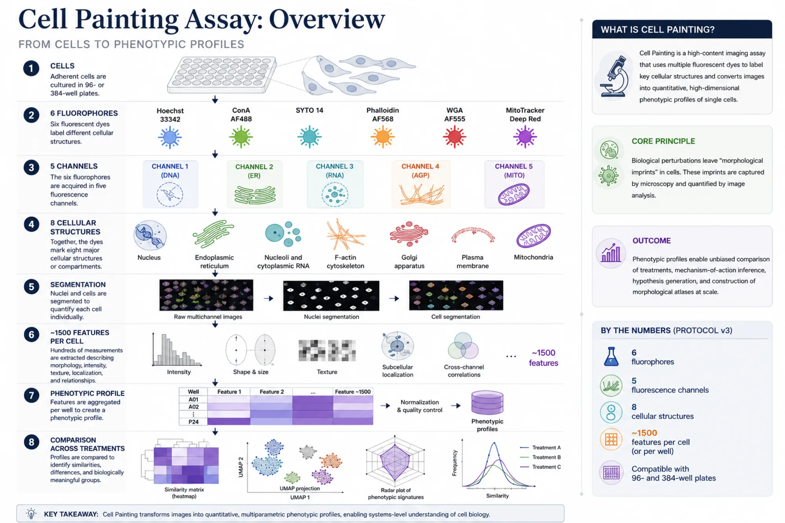

# Cell Painting: Principles, Evolution, and Applications of Phenotypic Profiling

## Learning objectives

- Understand the scientific problem that motivated the development of *Cell Painting*.
- Explain why *Cell Painting* represents a paradigm shift in HCI/HCA.
- Learn about its historical evolution, main applications, public datasets, and limitations.
- Describe the biological and experimental logic of the fluorophores, channels, and cellular structures labeled in *Cell Painting*.
- Understand why the assay uses six fluorophores acquired in five channels and how this represents a break from traditional fluorescence microscopy paradigms.

## 1. Introduction

As discussed in the microscopy module, high-content analysis has transformed the way fluorescence images are used in cell biology. Microscopy is no longer employed solely as a tool for producing representative images; it has also become a source of quantitative, multiparametric data that can be analyzed at scale.

Within this context, *Cell Painting* plays a central role. It is a high-content image-based phenotypic profiling assay in which multiple fluorophores label different cellular structures. From these images, hundreds to thousands of quantitative features can be extracted, allowing cellular perturbations to be compared in a broad and untargeted manner.

*Cell Painting* aims to quantitatively describe the cellular state through the simultaneous labeling of multiple cellular structures and compartments. Rather than measuring a single biological pathway, the method generates an integrated phenotypic signature that can be compared across different perturbations to identify similarities, differences, and biological relationships.

### The assay

In its classical formulation, the protocol uses six fluorophores acquired in five fluorescence channels to label eight cellular structures. After cell segmentation, approximately 1,500 quantitative *features* can be extracted from each cell, describing properties such as intensity, shape, texture, size, granularity, spatial localization, and relationships between channels. These measurements can then be aggregated to represent the phenotypic profile of a well or experimental condition.

The fundamental idea behind the method is simple but powerful: different biological perturbations leave morphological signatures in cells. These signatures are not always perceptible to the human eye, but they can be quantitatively captured through image analysis and used to compare cellular states, generate hypotheses about biological mechanisms, and organize perturbations according to their phenotypic similarity.

!!! note
    *Cell Painting* was not developed to measure a specific molecular pathway. It was designed to broadly describe the cellular state, using morphology as an integrated readout of the biological response.

## 2. The scientific problem

For many years, microscopy was used primarily to answer specific questions. For example: does a compound induce the nuclear translocation of a protein? Does a treatment reduce the number of cells? Does a cell death marker increase after exposure to a substance?

These questions are important and remain useful. However, they depend on a prior hypothesis. To design this type of assay, the researcher must know in advance which pathway, organelle, protein, or endpoint should be measured.

The problem is that cells rarely respond in isolation. When exposed to a chemical, genetic, or environmental perturbation, cells may undergo simultaneous changes in metabolism, nuclear architecture, cytoskeletal organization, vesicular trafficking, mitochondrial function, and proliferative state. If only one variable is measured, a large part of the cellular response may be missed.

*Cell Painting* emerged precisely as a response to this limitation. Instead of asking whether a specific pathway has been activated, it asks: **how has the overall cellular state changed?**

This shift is conceptually important. The objective is no longer limited to confirming a hypothesis; it also includes discovering unexpected phenotypic patterns. For this reason, *Cell Painting* has become one of the main approaches used for mechanism-of-action discovery, perturbation comparison, phenotypic screening, predictive toxicology, and the construction of morphological atlases.

## 3. Why does Cell Painting work?

A common question is: how can images of cells provide information about mechanism of action or biological state?

The answer lies in the fact that molecular changes propagate to cellular structures. Proteins, signaling pathways, metabolism, oxidative stress, vesicular trafficking, and cytoskeletal organization affect organelles and cellular compartments. These changes can alter shape, texture, intensity, spatial distribution, and relationships between structures.

*Cell Painting* exploits precisely this relationship. It does not directly measure the activity of an enzyme, the presence of a stress marker, or the expression of a specific gene. Instead, it measures the integrated morphological consequences of these changes.

We can think of the following chain:

**Molecular perturbation**  
↓  
**Changes in cellular pathways**  
↓  
**Changes in organelles and subcellular structures**  
↓  
**Changes in intensity, texture, shape, and spatial organization**  
↓  
**Quantitative phenotypic profile**

For this reason, *Cell Painting* should not be interpreted as a stand-alone mechanistic assay. It is a tool for generating, comparing, and organizing phenotypic signatures. Biological mechanisms can be inferred through similarity to known perturbations, but these inferences must be validated using orthogonal assays.

!!! tip
    A useful way to interpret *Cell Painting* is to think of it as a cellular "morphological fingerprint." This fingerprint does not automatically reveal the molecular cause, but it allows cellular states to be compared systematically.

## 4. Historical evolution

In the first version, six fluorophores were acquired in five channels and labeled seven organelles or cellular structures, including the nucleus, endoplasmic reticulum, nucleolus, Golgi apparatus, plasma membrane, F-actin filaments, and mitochondria. As a proof of concept, the authors used U2OS cells, approximately 1,600 compounds, and extracted 824 *features* using CellProfiler. The analysis demonstrated that morphological profiles could group compounds with similar mechanisms of action.

This first version provided proof of concept for the method: images can be used to capture broad phenotypic signatures. However, important limitations remained, including the need for greater experimental standardization, optimization of staining conditions, definition of controls, and development of more robust analysis workflows.

Three years later, Bray and colleagues published a more detailed and mature protocol. This version consolidated *Cell Painting* as a versatile and reproducible approach, incorporating independent advances from the Broad Institute and Recursion Pharmaceuticals. The protocol came to label eight cellular components: the nucleus, endoplasmic reticulum, nucleoli, cytoplasmic RNA, F-actin cytoskeleton, Golgi apparatus, plasma membrane, and mitochondria.

This advance also reflected computational improvements. With the development of CellProfiler *pipelines*, it became possible to extract approximately 1,500 *features* per cell or per well. The work also provided detailed recommendations for plate *layout*, controls, replicates, image acquisition, illumination correction, quality control, and feature extraction.

The third major stage came with the optimized protocol associated with the JUMP Cell Painting Consortium, published by Cimini and colleagues in 2023. This consortium brought together pharmaceutical companies, nonprofit organizations, and technology companies to standardize, optimize, and scale *Cell Painting*.

This version introduced experimental and analytical advances. These included the introduction and systematic use of metrics such as *Percent Replicating* (PR) and *Percent Matching* (PM), which are used to assess replicate reproducibility and the ability of similar profiles to recover related perturbations. The protocol also tested practical changes intended to facilitate automation, reduce costs, improve signal, and increase robustness.

Among these optimizations, MitoTracker began to be added directly to the culture medium without a medium change, reducing cell loss. The actual MitoTracker concentration was corrected to 500 nM. The permeabilization and staining steps were combined. Some fluorophore concentrations were reduced without a relevant loss of quality, whereas the concentration of SYTO 14 was increased to improve the signal-to-noise ratio. The final volume was also reduced, and it was demonstrated that fixed plates could be imaged for up to two weeks with little loss of quality.

Thus, the history of *Cell Painting* can be understood as a progression through three stages: first, the demonstration that morphological profiles were biologically informative; second, the consolidation of a reproducible protocol; and finally, optimization for scale, standardization, and use in large consortia.

## 5. The biological logic of the markers

*Cell Painting* uses fluorophores that label broadly informative cellular structures. The choice of these markers is not arbitrary. Each compartment provides a window into different aspects of cell biology.

The nucleus provides information about cell number, nuclear morphology, chromatin condensation, and changes in the cell cycle. The endoplasmic reticulum provides information about secretory organization and protein biosynthesis. Cytoplasmic RNA and nucleoli reflect aspects of biosynthetic activity. Actin provides information about adhesion, spreading, contraction, and cellular architecture. The Golgi apparatus and plasma membrane provide information about trafficking, polarity, and organization of the cell surface. Mitochondria provide information about metabolism, organelle distribution, and energetic state.

Because the cellular response to different perturbations is broad, complex, and diverse, the assay attempts to cast several nets to capture relevant information. Within this sea of information, however, many measurements are redundant and must be efficiently selected to obtain meaningful information that can consistently represent different cellular responses.

The table below summarizes the main fluorophores, channels, and structures labeled in the classical *Cell Painting* protocol.

| Marker | Excitation (nm) | Emission (nm) | Labeled structures | CellProfiler channel | Why is it biologically informative? | Notes |
|---|---:|---:|---|---|---|---|
| **Hoechst 33342** | 387/11 | 417–477 | Nucleus/DNA | DNA | Enables nuclear segmentation, cell counting, nuclear morphology measurements, and inferences about the cell cycle | In protocol v3, reduced from 5 to 1 µg/mL |
| **Concanavalin A / Alexa Fluor 488** | 472/30 | 503–538 | Endoplasmic reticulum | ER | Reflects secretory organization, protein biosynthesis, and perinuclear architecture | In v3, reduced from 100 to 5 µg/mL; it must be sufficiently bright to mask SYTO 14 bleed-through |
| **SYTO 14** | 531/40 | 573–613 | Nucleoli and cytoplasmic RNA | RNA | Provides information about biosynthetic activity, RNA content, and nucleolar organization | In v3, increased from 3 to 6 µM; when bound to RNA, it exhibits maxima near 521/547 nm |
| **Phalloidin / Alexa Fluor 568** | 562/40 | 622–662 | F-actin cytoskeleton | AGP | Provides information about adhesion, spreading, cell shape, and structural organization | Shares the channel with WGA |
| **WGA / Alexa Fluor 555** | 562/40 | 622–662 | Golgi apparatus and plasma membrane | AGP | Reflects membrane organization, trafficking, and Golgi-associated compartments | The balance with phalloidin is critical |
| **MitoTracker Deep Red** | 628/40 | 672–712 | Mitochondria | Mito | Provides information about mitochondrial distribution, metabolic organization, and structural changes | Added to live cells before fixation; corrected to 500 nM in v3 |

!!! note
    The value of *Cell Painting* does not lie in each marker individually, but in the combination of channels. Interpretation emerges from the multiparametric profile, not from a single fluorescence intensity measurement.

## 6. Channel logic and spectral overlap

### 6.1 Why six fluorophores in five channels?

In fluorescence microscopy, a traditional rule is to avoid spectral overlap as much as possible. The classical ideal would be to associate one fluorophore with one channel and one channel with one structure. This strategy facilitates direct interpretation of the signal source.

*Cell Painting* partially broke with this paradigm. Rather than attempting to perfectly separate every fluorophore, the assay accepted a certain degree of overlap to increase the number of cellular structures measured. This was a deliberate choice: the objective was not to interpret each channel as an isolated marker, but to produce a sufficiently rich phenotypic profile for comparing cellular states.

This was an important conceptual decision. The technique sacrificed part of its spectral specificity in exchange for a higher density of morphological information. The success of the method demonstrated that, when experimental design, acquisition, and analysis are well controlled, this strategy can be extremely powerful.

### 6.2 The AGP channel: actin, Golgi, and plasma membrane

The first important example of planned overlap occurs in the AGP channel. In this channel, phalloidin labels F-actin filaments, whereas WGA mainly labels the Golgi apparatus and plasma membrane. The fluorophores conjugated to these markers emit within the same spectral range, and their signals are therefore acquired together.

At first glance, this may appear to be a limitation. However, the labeled structures occupy partially distinct cellular regions. Actin is distributed across fibers, the cell cortex, and adhesion regions, whereas the Golgi apparatus and plasma membrane display different spatial patterns. Thus, although the channel is shared, texture, localization, shape, and granularity *features* help capture distinct information.

The relative concentration of the markers and, consequently, the intensity of the staining are very important. If WGA is too intense, it can overpower the actin staining. If phalloidin dominates the channel, the contribution of the Golgi apparatus and plasma membrane may be reduced. For this reason, the balance between these markers was carefully optimized in the most recent versions of the protocol.

### 6.3 SYTO 14 and the challenge of overlap with the ER channel

The second important case involves SYTO 14. This nucleic acid marker has complex spectral behavior and can generate signal in regions close to the Concanavalin A channel used to label the endoplasmic reticulum.

When unbound, SYTO 14 tends to fluoresce more strongly in the green channel and may therefore contribute signal to the ER channel. When bound to RNA, its spectrum shifts, favoring the detection of nucleoli and cytoplasmic RNA in the appropriate channel. Even so, some degree of overlap may remain.

For this reason, Concanavalin A staining must be sufficiently robust for the endoplasmic reticulum signal to remain distinguishable and not be dominated by SYTO 14 bleed-through. This issue is especially important in microscopes that use fixed fluorescence filter cubes, such as some automated acquisition systems, in which emission windows cannot be freely adjusted.

In adapted protocols, particularly when the instrument does not allow adequate spectral separation, it may be necessary to remove or replace SYTO 14. In instruments that use fixed filter sets, such as the Cytation, it can be difficult to avoid substantial bleed-through into other channels and, consequently, its use may not be recommended. This decision reduces some of the information related to RNA and nucleoli, but it may improve assay robustness on certain platforms.

!!! warning
    Spectral overlap in *Cell Painting* is not inherently an error. It becomes a problem when it compromises profile consistency, interferes with segmentation, or generates artificial differences between plates, treatments, or batches.

## 7. Closing remarks

*Cell Painting* represents a profound shift in the way microscopy is used in cell biology. Rather than searching only for a marker associated with a specific hypothesis, the technique seeks to describe the global cellular state through hundreds or thousands of morphological features.

This shift moves the focus from hypothesis confirmation toward the discovery of biological patterns. The image is no longer merely visual evidence; it becomes a source of quantitative data about the cellular state.

However, this richness of information requires rigor. Profile quality critically depends on experimental design, image acquisition, segmentation, feature extraction, normalization, and statistical analysis. In the next lesson, we will discuss the experimental and analytical *workflow* in greater detail, as well as different applications of the method.
