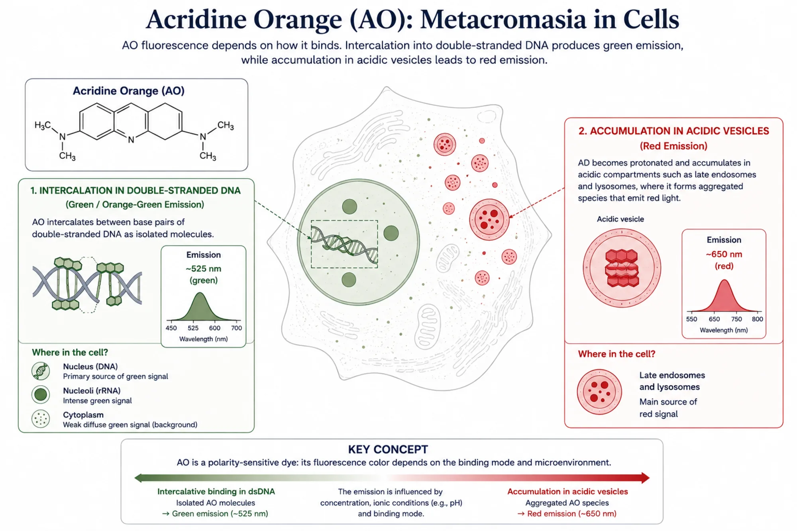

# Live Cell Painting — History and Overview

## Learning objectives

- Understand the experimental problem that motivated the development of LCP.
- Explain the rationale for using a metachromatic dye for phenotypic profiling.
- Compare Cell Painting and Live Cell Painting in terms of capabilities, limitations, and applications.
- Describe the LCP protocol and its critical steps.
- Understand how segmentation and feature extraction generate phenotypic profiles.
- Apply the observation → result → interpretation → limitations framework to LCP applications.
- Recognize the limitations of LCP and when orthogonal assays are required.

!!! note
    **Live Cell Painting (LCP)** is a *High-Content Analysis* assay based on a single metachromatic dye, Acridine Orange (AO), which enables the extraction of morphological profiles from living cells and the detection of subtle phenotypic perturbations that are often not detectable using conventional cell-health assays.

## 1. Brief history

In the lessons on [viability assays](../../20-cell-culture-and-cell-health/index.md), we saw that different methods measure distinct dimensions of cell health, including metabolism, membrane integrity, proliferation, and mitochondrial function. We also saw that the absence of evident cytotoxicity does not imply the absence of biological perturbation. In other words, sublethal phenotypes may arise well before any detectable loss of viability.

In the lesson on [*Cell Painting*](../cell-painting-principles-and-applications/index.md), we explored an approach that radically expands detection power. Instead of performing only a few preselected measurements, *Cell Painting* extracts approximately 1,500 morphological descriptors, or *features*, per cell, capturing phenotypic signatures that can provide information about mechanisms of action, toxicity, and gene function. However, *Cell Painting* requires cell fixation, which prevents the observation of living cells and may introduce processing artifacts.

An important experimental gap exists between these two extremes. On one side, conventional cell-health assays are relatively simple and accessible, but generally measure only a few endpoints. On the other, *Cell Painting* offers substantial information richness, but requires a more complex protocol, multiple fluorophores, appropriate infrastructure, and a relatively sophisticated computational workflow.

This gap became especially relevant in nanotoxicology. By the end of the 2010s, criticism increasingly focused on the fact that concentrations used in *in vitro* studies often did not represent exposure levels found in humans or the environment. The field began to prioritize more biologically and environmentally relevant concentrations. At these lower concentrations, many nanomaterials no longer produce detectable responses in conventional cell-health assays, such as MTT, resazurin, or Calcein/PI, even though they may still induce significant phenotypic alterations.

!!! note "Central idea"
    *Live Cell Painting* emerged from the convergence of two needs: detecting sublethal perturbations that escape traditional assays and performing phenotypic profiling in living cells without relying on fixation, permeabilization, and multiplex staining.

The central idea is simple but powerful: rather than asking only whether a cell is alive or dead, investigate **how its morphology is being modified** by a perturbation. Subtle alterations in cellular organization often precede loss of viability and may reveal important biological responses that would remain undetected by traditional assays. LCP makes this investigation possible in living cells using a single dye and an accessible protocol.

The method was formalized in the study *Live-cell painting: Image-based profiling in live cells using acridine orange*, published by Garcia-Fóssa and colleagues in 2025 [1]. A detailed protocol was published separately by Moraes-Lacerda and colleagues in 2025 [2]. The experimental and analytical details of the protocol will be discussed in the next lesson.

## 2. From Cell Painting to Live Cell Painting

*Cell Painting* established the paradigm of morphological profiling by combining multiple fluorescent dyes to label as many organelles as possible, extracting hundreds to thousands of *features* per cell, and comparing profiles across experimental conditions. This paradigm demonstrated that the information richness of multiparametric images greatly exceeds that of single-endpoint assays.

However, CP operates exclusively with fixed cells. Although paraformaldehyde fixation is required for multiplex staining, it introduces important limitations. As demonstrated by Schnell et al. (2012), immunostaining in fixed cells can produce artifacts in protein distribution that do not reflect the physiological state of living cells. In addition, the planning, execution, and analysis of a *Cell Painting* assay are relatively complex. The method requires specific infrastructure, rigorous control of experimental conditions, and expertise in multiparametric image acquisition and analysis.

It was within this context that we proposed *Live Cell Painting*. The method arose from the need to assess sublethal effects caused by nanomaterials, but also from the search for an intermediate approach between conventional cell-health assays, which are widely available in laboratories, and more complex morphological profiling methods.

LCP provides a relatively rapid, accessible, and lower-cost experimental strategy. At its core is Acridine Orange, a metachromatic dye capable of emitting fluorescence in different spectral regions depending on the chemical environment and the way its molecules are organized.

This property, which in some microscopy applications might be viewed as a spectral complication, becomes an advantage for profiling. A single marker provides morphological information from different cellular structures and compartments.

!!! info "A complementary approach"
    LCP does not attempt to reproduce the full organelle coverage of *Cell Painting*. Its purpose is to provide a simpler strategy for detecting and comparing phenotypic perturbations in living cells.

## 3. Cell Painting vs. Live Cell Painting: comparative analysis

Each method was designed to address different biological questions, and the choice between them should be guided by the experimental question.

### Comparative table

| Aspect | Cell Painting (CP) | Live Cell Painting (LCP) |
|---|---|---|
| **Dyes** | 6 (Hoechst, ConA/Alexa 488, SYTO 14, Phalloidin/Alexa 568, WGA/Alexa 555, MitoTracker Deep Red) | 1 (Acridine Orange) |
| **Imaging channels** | 5 (DNA, ER, RNA, AGP, Mito) | 2 (green: nucleus/cytoplasm; red: acidic vesicles) |
| **Inferred compartments/structures** | 8 (nucleus, nucleoli, ER, cytoplasmic RNA, actin, Golgi, plasma membrane, mitochondria) | 3–4 (nucleus, cytoplasm, nucleoli, acidic vesicles) |
| **Cell state** | Fixed (3.2% PFA) | Living |
| **Features per cell** | ~1,500 | Hundreds (fewer than CP, but sufficient for *profiling*) |
| **Organelle specificity** | Higher, owing to dedicated markers | Lower, because AO is not an organelle-specific marker |
| **Mechanistic resolution** | Greater ability to associate alterations with specific channels and structures | Lower organelle resolution; suitable for detecting and comparing phenotypic patterns |
| **Main application** | Large-scale *profiling*, MoA prediction, and drug discovery | Cell-health screening and detection of sublethal perturbations |
| **Maturity** | High (more than 10 years, JUMP Consortium, validated v3 protocol) | Recent method that is still under development |
| **Analysis pipeline** | CellProfiler + pycytominer (standardized) | Adapted CellProfiler + pycytominer |

The table above shows that CP and LCP occupy distinct experimental niches, with partial overlap.

**When CP is more informative:** when the objective is to predict mechanism of action (MoA), compare large compound libraries, or perform large-scale profiling with organelle-level resolution. CP provides more channels, more *features*, and a much broader validation base. The JUMP Consortium demonstrated that CP can group compounds by mechanism of action with *Percent Matching* values of approximately 16–26%, a modest result in absolute terms but impressive considering the complexity of the problem.

**When LCP is more useful:** when the objective is to rapidly detect phenotypic perturbations in living cells using a simple, economical, and easily implemented protocol. Although it provides less organelle-specific information than *Cell Painting*, LCP preserves the living-cell state and substantially reduces experimental complexity by using a single fluorophore and eliminating fixation, permeabilization, and multiplex staining steps. These characteristics make it particularly attractive for small- or medium-scale screens, hypothesis validation, and laboratories seeking to incorporate morphological profiling without the infrastructure required for a complete *Cell Painting* protocol.

In addition to its experimental applications, LCP is an excellent platform for training in *High-Content Analysis*. Its simplicity allows students and researchers to gain practical experience with all fundamental stages of an HCA experiment—image acquisition, segmentation, feature extraction, construction of phenotypic profiles, and biological interpretation—before moving on to more complex approaches such as conventional *Cell Painting*.

**Combined strategy:** in many projects, LCP may serve as an initial screening step to identify conditions that produce relevant phenotypic perturbations. These conditions can then be investigated in greater depth using *Cell Painting*, which provides greater organelle-level resolution and a richer phenotypic space for mechanistic exploration. This two-stage strategy combines the speed of LCP with the analytical power of CP and is particularly useful in nanotoxicology studies and exploratory projects.

## 4. Acridine Orange: the central fluorophore in LCP

Acridine Orange (AO) is a metachromatic fluorescent dye, meaning that its emission changes depending on the chemical microenvironment—including pH, ion concentration, and polarity—in which it is located. This property is the foundation of LCP.

### Dual-fluorescence mechanism

When AO intercalates into nucleic acids, including DNA and RNA, its fluorescence is dominated by green emission, with a peak near 525 nm. When AO accumulates in acidic compartments, such as late endosomes and lysosomes, protonation and the high local concentration of H^+^ ions promote molecular stacking, shifting emission toward the red region, with a peak near 650 nm. This dual behavior allows a single dye to simultaneously visualize:

- **Green channel (AOGFP):** nucleus (DNA), nucleoli (RNA), and cytoplasm (diffuse RNA);
- **Red channel (AOPI):** acidic vesicles, including lysosomes and late endosomes.

### Why a single dye can be sufficient for profiling

At first glance, using only one fluorophore may appear limiting compared with *Cell Painting*, which employs multiple specific markers for different organelles. However, the goal of morphological *profiling* is not necessarily to identify each cellular structure individually, but to capture phenotypic patterns rich enough to distinguish different biological states.

Acridine Orange is particularly useful in this context because a single dye provides information from multiple cellular compartments. Rather than depending on the molecular specificity of each marker, *Live Cell Painting* uses combinations of fluorescence intensity, texture, spatial distribution, and signal organization to construct morphological signatures. Thus, the information emerges from the combination of hundreds of measurements extracted from the images, rather than from the isolated interpretation of each channel.

During method development, however, an important challenge emerged. Previous studies often recorded fluorescence from acidic vesicles using a channel corresponding to RFP, approximately 560–610 nm. Under this configuration, there is substantial overlap between the green and red AO signals. As a result, both channels largely capture the same cellular structures. For computational analysis, this redundancy is undesirable because it adds relatively little new information to the dataset, increases correlation among extracted *features*, and may hinder the identification of truly relevant patterns in downstream analyses and machine-learning models.

To minimize this problem, *Live Cell Painting* acquires the acidic-vesicle signal in a spectral region shifted further toward the red, using the PI channel, approximately 610–690 nm. This strategy substantially reduces spectral overlap between the two channels and increases the independence of the information they provide, allowing profiling algorithms to explore more informative and less redundant descriptors.

AO also has a particularly important property for computational analysis: it can provide sufficient contrast to identify both the nucleus and cytoplasm, enabling cell segmentation and the extraction of hundreds of individual morphological measurements. As in any *High-Content Analysis* approach, segmentation quality is critical because all subsequent stages depend on it.

### Spectral limitations

The broad fluorescence emission of Acridine Orange makes it difficult to combine with other fluorophores. Because its emission spectrum spans a broad range of the visible spectrum, adding fluorescent markers increases the risk of signal overlap, or *bleed-through*, reducing the independence of the information captured in each channel. This property limits multiplexing in *Live Cell Painting* and represents an important difference from *Cell Painting*, which was designed to combine six dyes across five channels with carefully controlled spectral overlap.

An exception may occur when AO labeling of the nucleus and cytoplasm does not provide enough contrast for robust segmentation. In such cases, adding a nuclear marker compatible with living cells—for example, Hoechst 33342 acquired in the DAPI channel, approximately 410–480 nm—may be advantageous while preserving spectral separation from the AO channels. This strategy was successfully used in HepG2 cells, improving segmentation without substantially compromising the information content of the assay.

Figure 1: Metachromatic principle of Acridine Orange in Live Cell Painting. When associated with nucleic acids, AO exhibits predominantly green emission, whereas its accumulation in acidic compartments favors the formation of aggregated species with red emission. This dual response provides complementary information about the nucleus, nucleoli, cytoplasm, and acidic vesicular compartments using a single dye.

## 5. Closing remarks

*Live Cell Painting* was developed to fill a gap between conventional cell-health assays and more complex morphological profiling approaches.

Its principle is to use the metachromatic behavior of Acridine Orange to extract complementary information from living cells in two fluorescence channels. Although the method does not provide the same organelle coverage as *Cell Painting*, it enables the detection of subtle phenotypic alterations with lower experimental complexity.

The value of LCP does not lie in automatically assigning an alteration to a specific organelle or mechanism. Its value lies in transforming image patterns into quantitative profiles that can be compared across conditions.

The experimental simplicity of LCP does not eliminate the need for rigor. Cell-culture quality, dye concentration, staining time, acquisition parameters, segmentation, and quality control can profoundly affect the resulting profiles.

!!! note "Main message"
    LCP does not replace mechanistic assays or *Cell Painting*. It offers a complementary, accessible, and informative approach for detecting and comparing phenotypic perturbations in living cells.
