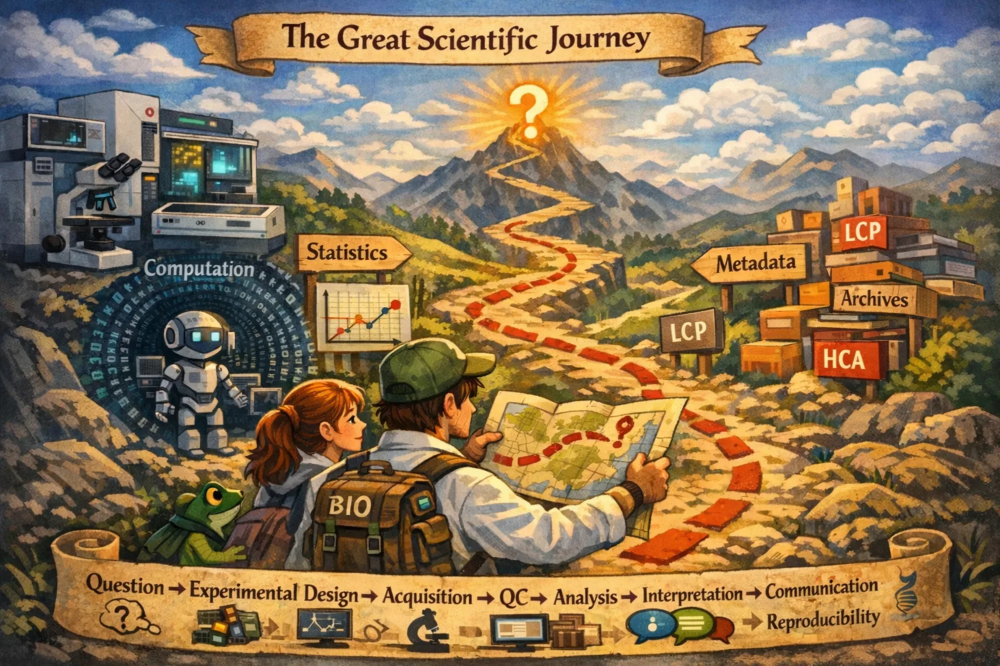

# High-Content Imaging and High-Content Analysis Course

This project provides an integrated learning pathway in **High-Content Imaging** and **High-Content Analysis** (HCI/HCA), connecting scientific questions, experimental design, cell culture, microscopy, image analysis, and data interpretation.

The material was developed to support graduate students and researchers who want to plan, perform, and analyze HCI/HCA experiments with rigor, critical thinking, and reproducibility.

!!! info "About this material"
    This material was developed around the training needs of our laboratory, which uses *Live Cell Painting* as one of its main models for integrating cell culture, microscopy, image analysis, and phenotypic profiling. Despite this context, the concepts and practices presented here are applicable to different HCI/HCA assays and projects.

    The content is continuously evolving. If you find an error or inconsistency, or have suggestions for improvement, feel free to open an *issue* in the repository. If you prefer to discuss something privately, please send an email.

## Overview of the learning journey

The course follows the complete cycle of an HCI/HCA project:

**Question → experimental design → biological preparation → acquisition → quality control → analysis → interpretation → communication → reproducibility**

Although the modules can be consulted independently, the course was designed as a progressive learning journey. It begins with the formulation of the scientific question and experimental preparation, moves through image formation and analysis, and leads to the interpretation of phenotypic profiles and the construction of reproducible workflows.

## Course structure

### 0. [Onboarding](00-onboarding/index.md)

Introduces the conceptual and operational foundations required to plan rigorous HCI/HCA projects, including scientific questions, experimental design, *batch effects*, Git, and work organization.

### 1. [Microscopy and acquisition](10-microscopy-and-acquisition/index.md)

Explains how images are formed and how resolution, fluorescence, signal, background, saturation, and acquisition parameters affect the data produced by an experiment.

### 2. [Digital images and analysis](11-digital-images-and-analysis/index.md)

Shows how an image becomes quantitative data, covering pixels, intensities, channels, bit depth, noise, and the transformation of images into measurement tables.

### 3. [Computational foundations for image analysis](12-computational-foundations-image-analysis/index.md)

Introduces computational environments, tabular data, Python code reading, and validation strategies needed to understand and execute image-analysis pipelines.

### 4. [Cell culture and cell health](20-cell-culture-and-cell-health/index.md)

Presents principles of cell-culture quality, assay design, experimental controls, and the evaluation of lethal, sublethal, and cytostatic cellular responses.

### 5. [Cell culture training](21-cell-culture-training/index.md)

Organizes practical training in cell culture, from aseptic technique, observation, and passaging to cell counting, plating, dose–response experiments, and experimental documentation.

### 6. [HCA assays](30-hca-assays/index.md)

Introduces multiparametric assays such as *Cell Painting* and *Live Cell Painting*, integrating biological principles, experimental execution, image acquisition, and analysis.

### 7. [Tutorials](40-tutorials/index.md)

Provides practical guides for installing tools, configuring computational environments, and performing the analyses and visualizations used throughout the course.

## Where to begin

If this is your first time using the course, begin with the [Onboarding](00-onboarding/index.md) and proceed through the modules in the order presented.

If you already have experience in some of these areas, you can also use the site as a reference resource and go directly to the module most relevant to your needs.

Use the navigation menu to browse the lessons and the site search to find concepts, tools, protocols, and specific stages of the pipeline.
