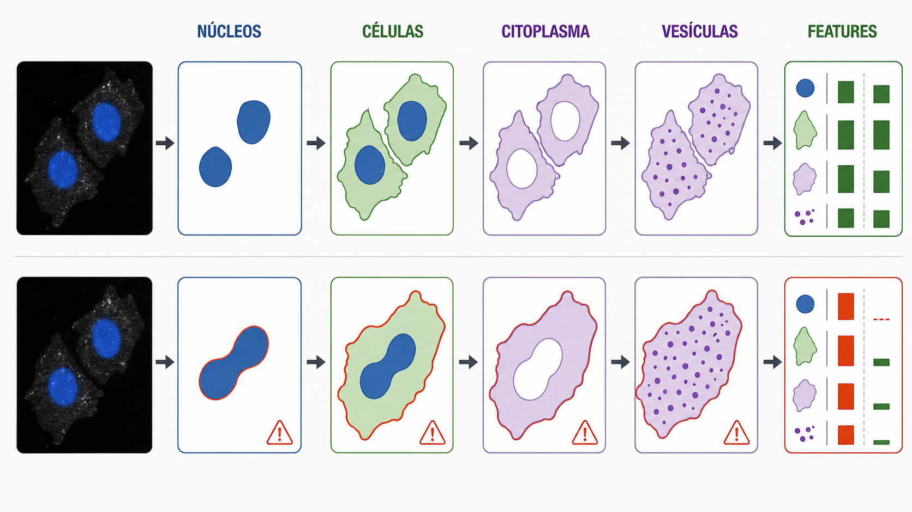

# 05. Rodando o AssayDev

## Objetivos de aprendizagem

Ao final desta aula, você deverá ser capaz de:

- explicar o papel do AssayDev antes da análise completa;
- distinguir segmentação, identificação de objetos e medição;
- avaliar erros ocasionais e sistemáticos de segmentação;
- selecionar imagens representativas para controle de qualidade;
- justificar critérios de aceitação sem buscar uma segmentação artificialmente perfeita.

## 1. O que está sendo desenvolvido?

Assay Development, ou **AssayDev**, é a etapa em que transformamos uma estratégia geral de análise em uma representação adequada para o ensaio real. O objetivo não é ajustar uma única imagem, mas verificar se as regras de identificação funcionam de maneira suficientemente consistente entre controles, tratamentos, placas e variações de densidade celular.

No pipeline de Live Cell Painting, o AssayDev é executado em um subconjunto das imagens, normalmente um site por poço. Esse desenho reduz o custo de teste e ainda oferece amostragem distribuída pela placa.

O produto central do AssayDev não é uma tabela para interpretação biológica. É uma decisão documentada sobre se a segmentação está pronta para medir o experimento completo.

## 2. Segmentação é uma hipótese operacional

Uma célula possui limites biológicos, mas esses limites nem sempre aparecem diretamente na imagem. O algoritmo identifica regiões a partir do sinal disponível e dos parâmetros fornecidos. A máscara resultante é, portanto, uma **representação operacional** do objeto.

```text
estrutura biológica
    → distribuição do marcador
    → imagem formada pelo sistema óptico
    → pixels observados
    → regra ou modelo de segmentação
    → objeto segmentado
```

Cada seta introduz limitações. Baixa relação sinal–ruído, desfoque, saturação, variação de expressão e sobreposição celular podem alterar a correspondência entre máscara e estrutura biológica.

É mais preciso dizer “o pipeline identificou 350 objetos nucleares” do que “havia exatamente 350 núcleos”, até que a qualidade da identificação seja avaliada.

## 3. A hierarquia dos objetos

No fluxo descrito no tutorial, os objetos são construídos de forma dependente:

1. `NucleiCP` representa núcleos identificados com Cellpose;
2. `Cells` expande ou delimita a célula a partir dos núcleos e do sinal citoplasmático;
3. `Cytoplasm` é calculado como a região celular excluindo o núcleo;
4. nucléolos e vesículas são identificados em regiões mascaradas apropriadas.

Um erro no objeto primário pode se propagar para todos os objetos dependentes. Dois núcleos unidos podem produzir uma célula incorreta; um núcleo ausente pode deixar uma célula sem semente; um contorno celular excessivo altera medidas do citoplasma e das vesículas.

Essa dependência explica por que o QC deve avaliar a hierarquia, não apenas a aparência de uma sobreposição final.



*Objetos secundários e terciários dependem dos objetos identificados anteriormente. Um erro nuclear pode alterar células, citoplasmas, atribuições subcelulares e as features calculadas.*

## 4. Imagens transformadas e imagens medidas

Suavização, realce, reescala e operações matemáticas podem tornar estruturas mais fáceis de segmentar. Essas imagens intermediárias respondem à pergunta: **onde está o objeto?**

As medidas de intensidade devem, em geral, ser realizadas sobre as imagens brutas apropriadas, respondendo: **qual sinal foi observado dentro do objeto?**

Separar imagem de segmentação e imagem de medição evita que uma transformação aplicada para localizar objetos seja interpretada como alteração biológica. O pipeline deve registrar claramente qual imagem alimenta cada módulo.

## 5. O que significa “good enough”?

Uma segmentação útil não precisa ser perfeita em todas as células. Ela precisa ser adequada à pergunta e não introduzir vieses sistemáticos capazes de dominar as comparações.

Erros **ocasionais** aparecem de forma esparsa, como uma célula excessivamente grande em um campo de sinal muito baixo. Eles podem ter impacto pequeno quando são raros e, em alguns casos, podem ser filtrados com critérios pré-definidos.

Erros **sistemáticos** dependem da condição, da placa ou de uma propriedade biológica. Por exemplo, se células tratadas ficam mais arredondadas e o algoritmo deixa de segmentá-las, a análise poderá concluir que apenas as células com fenótipo semelhante ao controle existem. Esse viés de seleção não é corrigido simplesmente aumentando o número de imagens.

Critérios de aceitação devem considerar:

- taxa de objetos ausentes, unidos ou divididos;
- consistência entre controles e tratamentos;
- estabilidade entre placas e regiões da placa;
- adequação das fronteiras para as features que serão medidas;
- frequência e impacto esperado dos erros.

## 6. Amostragem para controle de qualidade

Selecionar um site por poço distribui a inspeção pelo desenho experimental, mas não garante que toda a heterogeneidade foi observada. O conjunto de desenvolvimento deve incluir casos fáceis, difíceis e biologicamente distintos.

É recomendável inspecionar:

- controles negativos e positivos;
- doses baixas e altas;
- diferentes placas ou dias;
- campos densos e esparsos;
- bordas e centro da placa;
- fenótipos extremos esperados.

Escolher apenas imagens com boa aparência produz uma estimativa otimista da robustez. Escolher apenas as piores imagens pode levar a um pipeline complexo e superajustado.

## 7. Objetos nas bordas

Objetos que tocam a borda estão incompletos e podem distorcer medidas de área ou forma. Excluí-los cedo, porém, também pode alterar a segmentação de objetos vizinhos quando o núcleo serve de semente para delimitar a célula.

Não existe uma regra universal. Uma estratégia possível é manter os objetos durante a construção das máscaras e marcá-los ou filtrá-los antes de análises que exigem medidas completas. A escolha deve ser aplicada de forma consistente e documentada.

## 8. QC visual e quantitativo

Sobreposições de contornos são essenciais porque revelam como a máscara se relaciona com a imagem. Montagens por placa ajudam a detectar padrões espaciais, como perda de foco ou mudança de densidade nas bordas.

O QC visual deve ser complementado por resumos quantitativos, como número de objetos por campo, distribuição de áreas, intensidade de background e fração de campos excluídos. Um gráfico detecta tendências globais; a imagem ajuda a explicar sua origem. Nenhum dos dois substitui o outro.

Registrar as versões testadas do pipeline preserva a história das decisões e permite retornar a uma configuração anterior. “Versão final” sem histórico não mostra quais alternativas foram consideradas.

## 9. AssayDev e Analysis

O AssayDev e a Analysis compartilham a lógica de segmentação, mas têm objetivos diferentes.

| AssayDev | Analysis |
|---|---|
| usa subconjunto informativo | processa o conjunto completo |
| produz evidência de QC | produz medidas em escala |
| favorece inspeção e ajuste | favorece consistência e rastreabilidade |
| decide se o método está pronto | aplica o método aprovado |

Modificar parâmetros após observar os resultados fenotípicos pode introduzir viés. Ajustes posteriores podem ser necessários, mas devem ser justificados por critérios de qualidade, versionados e reavaliados em todo o conjunto relevante.

## 10. Fechamento

O AssayDev valida a ponte entre imagem e objeto mensurável. A segmentação é uma representação condicionada pelo marcador, pelo sistema de imagem e pelo algoritmo. Sua qualidade deve ser julgada pelo impacto sobre a pergunta científica, com atenção especial a erros sistemáticos.

### Principais conceitos

- O AssayDev é uma etapa de desenvolvimento e QC, não de conclusão biológica.
- Objetos segmentados são representações operacionais.
- Erros nos objetos primários propagam-se para objetos dependentes e features.
- Imagens transformadas para segmentação não devem ser confundidas com imagens de medição.
- Robustez entre condições é mais importante do que perfeição em uma imagem.

### Exercícios

1. Um tratamento reduz o sinal citoplasmático e as células tratadas passam a receber máscaras menores. Explique como isso pode afetar medidas de intensidade, área e textura.
2. Compare subsegmentação e sobresegmentação nuclear. Como cada erro pode se propagar para `Cells` e `Cytoplasm`?
3. Proponha uma amostra de 12 campos para desenvolver um pipeline em um experimento com duas placas, três doses e dois controles.
4. Defina um conjunto de critérios visuais e quantitativos para aprovar a segmentação. Indique quais dependem da pergunta biológica.
5. Discuta quando manter objetos de borda pode ser preferível e quando excluí-los é necessário.

### Para aprofundar

- Siga a seção [AssayDev — controle de qualidade da segmentação](../../40-tutoriais/lcp_pipeline/lcp_pipeline.html#assaydev-controle-de-qualidade-da-segmentação) para testar os módulos e salvar as montagens.
- Ao revisar as imagens, registre observação, resultado, interpretação e limitação separadamente.
