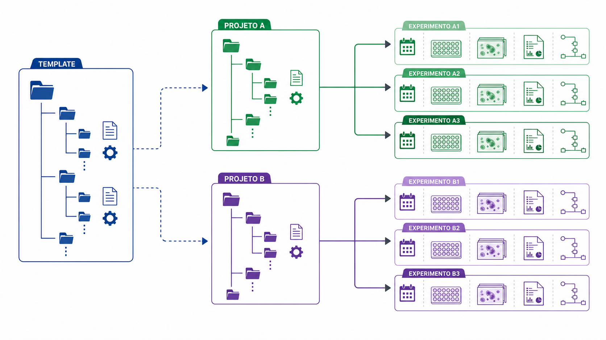

# 02. Criando seu projeto

## Objetivos de aprendizagem

Ao final desta aula, você deverá ser capaz de:

- explicar o problema resolvido por um template de projeto;
- distinguir template, projeto, experimento e ambiente computacional;
- interpretar as principais decisões solicitadas pelo `cookiecutter-lcp`;
- explicar como Git e Pixi contribuem para a reprodutibilidade;
- reconhecer o que deve ser personalizado e o que deve permanecer compartilhado.

## 1. Por que começar com um template?

Dois pesquisadores podem realizar análises equivalentes e, ainda assim, organizar arquivos, dependências e resultados de formas incompatíveis. Essa liberdade parece conveniente no início, mas dificulta a colaboração, a automação e a reprodução do trabalho.

Um **template de projeto** transforma convenções do laboratório em uma estrutura inicial executável. Ele não realiza o experimento nem escolhe a análise. Ele cria um ponto de partida comum, com pastas, arquivos de configuração e modelos de pipeline posicionados onde as ferramentas esperam encontrá-los.

O `cookiecutter-lcp` é esse molde para os projetos de Live Cell Painting do laboratório. Ao responder a um conjunto curto de perguntas, o pesquisador gera um novo repositório adaptado ao seu projeto, mas compatível com o mesmo fluxo usado pelo restante da equipe.

## 2. Template, projeto e experimento

Esses três níveis não devem ser confundidos:

- o **template** é o molde mantido pelo laboratório;
- o **projeto** é a cópia gerada para uma linha de investigação;
- o **experimento** é uma execução identificada dentro desse projeto.

Uma atualização futura do template não deve alterar silenciosamente projetos em andamento. Da mesma forma, um arquivo específico de um experimento não deve ser editado no diretório de `templates/`, pois isso modifica a base usada para criar os próximos experimentos.

Essa separação permite combinar padronização e autonomia: todos começam com a mesma arquitetura, mas cada projeto preserva suas decisões e seu histórico.



*O template fornece a arquitetura compartilhada; cada projeto é uma instância independente que reúne experimentos identificáveis por nomes e cores relacionados.*

## 3. O nome do repositório descreve o escopo

O nome do repositório deve representar o projeto inteiro, não apenas a primeira placa. Campos como modalidade, foco, modelo celular e categoria de perturbação ajudam a compor um nome estável, por exemplo:

```text
lcp-nanotoxicology-huh7-npps
```

Datas, concentrações e tempos de exposição pertencem normalmente ao nível do experimento. Colocá-los no nome do repositório tende a torná-lo obsoleto quando uma nova condição é incorporada.

Renomear um repositório após compartilhá-lo altera URLs, documentação e integrações. A decisão inicial deve, portanto, ser suficientemente ampla para acomodar o desenvolvimento previsível do projeto e suficientemente específica para distingui-lo de outros trabalhos.

## 4. O scaffold como contrato operacional

O conjunto de pastas e arquivos gerado é frequentemente chamado de **scaffold**. Ele funciona como um contrato entre pessoas e programas: define onde entram as imagens, onde ficam os metadados, de onde são copiados os pipelines e onde cada etapa grava seus produtos.

Alguns elementos existem uma única vez no projeto:

- o pacote compartilhado `hca_pipeline/`;
- os templates de pipeline e notebooks;
- modelos de segmentação reutilizáveis;
- o arquivo `pixi.toml`, que descreve o ambiente.

Outros são criados para cada `EXPERIMENT_ID`:

- metadados e associações de placas;
- cópias dos pipelines `.cppipe`;
- QC do AssayDev;
- saídas do CellProfiler;
- perfis e modelos derivados.

Copiar um template para a pasta do experimento cria uma versão que pode ser ajustada sem modificar a referência usada pelos experimentos futuros.

## 5. Reprodutibilidade tem mais de uma camada

Uma estrutura de pastas padronizada resolve apenas parte do problema. Para repetir uma análise, também precisamos conhecer os arquivos usados, as versões do código e o ambiente de software.

```text
reprodutibilidade computacional
≈ dados identificáveis
+ operações versionadas
+ ambiente especificado
+ parâmetros registrados
```

O **Git** registra a evolução de pipelines, notebooks, configurações e documentação. Um commit é um ponto identificado na história do projeto, não apenas uma cópia de segurança. Mensagens claras permitem relacionar uma mudança à decisão que a motivou.

O **Pixi** descreve e instala o ambiente usado pelos notebooks e pelo pacote de análise. Isso reduz diferenças entre computadores e evita que a expressão “funciona na minha máquina” seja a única documentação disponível.

O ambiente do CellProfiler com seus plugins pode seguir uma instalação própria, já apresentada no tutorial 00. Mesmo quando duas partes do pipeline usam gerenciadores diferentes, suas versões e limites precisam estar documentados.

## 6. Configuração não é resultado

Arquivos como `pixi.toml`, `.cppipe` e `experiment_config.json` descrevem como o processamento deve ocorrer. Bancos SQLite, tabelas Parquet e figuras são produtos dessa configuração aplicada aos dados.

Separar configuração e resultado traz duas vantagens. Primeiro, permite reexecutar o processamento sem editar o código principal. Segundo, facilita comparar experimentos que usam o mesmo método com parâmetros diferentes.

Uma configuração não garante que a análise seja cientificamente adequada. Ela garante que a decisão esteja registrada e possa ser examinada.

## 7. Automação e responsabilidade científica

O Cookiecutter automatiza tarefas repetitivas e reduz variações acidentais. Ele não valida a pergunta biológica, a escolha dos controles ou a qualidade das imagens. Também não determina se dois experimentos podem ser combinados.

Da mesma forma, o comando de verificação do ambiente confirma se dependências estão disponíveis, mas não prova que os dados estão corretos. É importante distinguir:

- **verificação técnica:** o software abre, importa pacotes e encontra arquivos;
- **controle de qualidade:** as entradas e saídas têm a estrutura esperada;
- **validação científica:** o desenho e as medidas sustentam a interpretação pretendida.

O template organiza essas verificações, mas a decisão continua sendo do pesquisador.

## 8. Ciclo de vida de um novo experimento

Depois que o projeto existe, cada novo experimento percorre um ciclo previsível:

```text
definir EXPERIMENT_ID
    → criar pastas a partir dos templates
    → registrar imagens e metadados
    → adaptar e versionar pipelines
    → executar QC e análise
    → preservar resultados e proveniência
```

Essa repetição é desejável. Ela permite que o estudante concentre sua atenção nas diferenças biologicamente relevantes, e não em reinventar a organização a cada placa.

## 9. Fechamento

O `cookiecutter-lcp` materializa decisões coletivas sobre organização e reprodutibilidade. Ao gerar uma estrutura estável, ele conecta o projeto aos pipelines e reduz ambiguidades. Seu valor não está apenas em criar pastas, mas em tornar explícitas as fronteiras entre material compartilhado, configuração específica e resultado experimental.

### Principais conceitos

- O template é mantido pelo laboratório; o projeto é uma instância independente.
- O repositório representa uma linha de investigação; o `EXPERIMENT_ID`, uma execução.
- Templates compartilhados não devem ser editados para acomodar um único experimento.
- Git registra a evolução dos arquivos leves; Pixi descreve o ambiente computacional.
- Automação técnica não substitui validação científica.

### Exercícios

1. Um aluno editou `workspace/pipelines/templates/analysis.cppipe` para analisar sua primeira placa. Explique por que isso pode afetar experimentos futuros e proponha um fluxo melhor.
2. Diferencie os papéis de `repo_name` e `EXPERIMENT_ID`. Crie um exemplo em que um repositório contenha três experimentos.
3. O comando de verificação do ambiente terminou sem erros. Quais aspectos do experimento ainda não foram validados?
4. Analise a afirmação: “Se o código está no GitHub, a análise é reprodutível.” Liste pelo menos quatro informações adicionais necessárias.

### Para aprofundar

- Acompanhe no tutorial as seções [Criando o projeto com o `cookiecutter-lcp`](../../40-tutoriais/lcp_pipeline/lcp_pipeline.html#criando-o-projeto-com-o-cookiecutter-lcp) e [Criando um novo experimento](../../40-tutoriais/lcp_pipeline/lcp_pipeline.html#criando-um-novo-experimento). Identifique quais arquivos são compartilhados e quais são copiados por experimento.
- Consulte a aula 01 para revisar a relação entre versionamento, preservação e proveniência.
