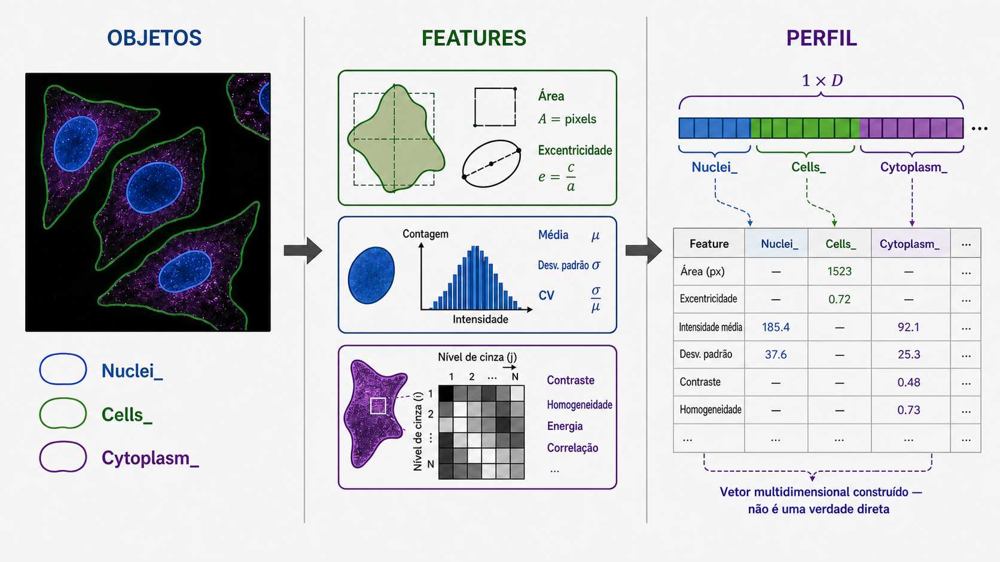

# 06. Rodando a análise

## Objetivos de aprendizagem

Ao final desta aula, você deverá ser capaz de:

- explicar a transição do AssayDev para a análise completa;
- distinguir objeto, feature e perfil fenotípico;
- reconhecer famílias de medidas produzidas pelo CellProfiler;
- explicar por que proveniência e consistência são essenciais na extração;
- avaliar o que uma tabela de features permite e ainda não permite concluir.

## 1. Escalar um método validado

Depois que a segmentação foi avaliada no AssayDev, o pipeline de Analysis aplica a estratégia ao conjunto completo de imagens. Essa passagem não é apenas “rodar por mais tempo”. Ela muda a prioridade de ajuste interativo para execução consistente e auditável.

Os módulos de segmentação aprovados são transferidos para o pipeline de análise, enquanto filtros usados apenas para selecionar um site de QC são removidos. Módulos de medição e exportação transformam os objetos em linhas e colunas.

```text
imagem
    → objetos segmentados
    → medidas por objeto
    → tabelas de célula única
```

O sucesso técnico da execução significa que o pipeline terminou e produziu arquivos. A validade científica depende da qualidade das imagens, das máscaras, das features e dos metadados.

## 2. Objeto, feature e perfil

Um **objeto** é uma região identificada, como núcleo, célula ou citoplasma. Uma **feature** é uma medida calculada para esse objeto, como área, intensidade média ou textura. Um **perfil fenotípico** é um vetor formado por múltiplas features, geralmente após processamento e agregação.

Esses termos descrevem níveis diferentes:

```text
objeto: onde medir
feature: o que foi calculado
perfil: conjunto de features que representa uma unidade
```

O perfil não é uma fotografia literal do “estado celular”. Ele é uma representação construída a partir dos marcadores, objetos e algoritmos escolhidos.



*A segmentação define onde medir, as features quantificam propriedades dos objetos e o conjunto dessas medidas forma uma representação fenotípica construída.*

## 3. Famílias de features

O CellProfiler pode calcular centenas ou milhares de medidas. Elas pertencem a famílias com sensibilidades distintas.

| Família | Exemplos conceituais | Pode ser sensível a |
|---|---|---|
| tamanho e forma | área, perímetro, excentricidade | qualidade da máscara, células cortadas |
| intensidade | média, máximo, intensidade integrada | exposição, background, saturação |
| textura | organização local de intensidades | foco, escala, ruído, parâmetros |
| granulosidade | estruturas em diferentes escalas | resolução, suavização, tamanho de objeto |
| relações espaciais | distância e vizinhança | densidade, segmentação e desenho amostral |

Uma feature tem um nome matemático, mas seu significado biológico depende do compartimento e do canal. `Nuclei_AreaShape_Area` e `Cells_AreaShape_Area` não medem a mesma região, embora compartilhem a mesma operação geométrica.

## 4. Medir na imagem apropriada

Imagens derivadas podem facilitar a segmentação, mas alterar intensidade e textura. Se uma imagem foi suavizada, elevada ao quadrado ou reescalonada para realçar um objeto, medir nela muda a quantidade calculada.

O pipeline deve manter a separação:

- imagens derivadas ajudam a definir **onde** estão os objetos;
- imagens brutas apropriadas fornecem o sinal sobre o qual as features são medidas.

Há exceções justificáveis, como uma correção de iluminação validada. Nesses casos, a transformação passa a fazer parte da definição da medida e precisa ser documentada.

## 5. Relações entre compartimentos

As tabelas de `Cells`, `Nuclei` e `Cytoplasm` precisam manter identificadores que permitam reconstruir qual núcleo e qual citoplasma pertencem à mesma célula. Metadados de imagem localizam essa célula em placa, poço e site; números de objeto mantêm relações dentro do campo.

Sem essas chaves, juntar tabelas apenas pela ordem das linhas seria perigoso. Uma célula filtrada em um compartimento poderia deslocar todas as associações seguintes.

O vínculo entre compartimentos é uma relação computacional criada pelo pipeline. Ele deve ser verificado antes que features de objetos distintos sejam combinadas em um perfil único.

## 6. Mais features não significam mais informação

Muitas features podem ser redundantes, quase constantes, extremamente ruidosas ou dominadas por efeitos técnicos. A extração ampla preserva possibilidades analíticas, mas também aumenta dimensionalidade e multiplicidade.

Nesta etapa, o CellProfiler calcula medidas. Ele ainda não determina quais delas são reprodutíveis, informativas ou biologicamente relevantes. Seleção de features, normalização e agregação pertencem ao pré-processamento.

Remover features apenas porque não mostram a separação esperada pode introduzir viés de confirmação. Critérios devem ser definidos com base em qualidade, redundância, estabilidade e desenho experimental.

## 7. Formato de saída e proveniência

O pipeline pode exportar tabelas CSV ou um banco SQLite. A escolha afeta armazenamento e leitura, mas não deveria alterar o significado das medidas.

CSV é simples de inspecionar, porém pode gerar muitos arquivos e exigir combinação posterior. SQLite preserva tabelas relacionadas em um único banco e permite consultas seletivas, mas requer ferramentas de leitura apropriadas.

Independentemente do formato, a saída deve estar ligada a:

- versão do pipeline;
- lista de imagens processadas;
- configuração do CellProfiler e plugins;
- modelo de segmentação;
- metadados do experimento;
- registro de imagens ou campos excluídos.

## 8. Controle de qualidade após a execução

Uma execução completa pode revelar problemas ausentes na amostra do AssayDev. Antes de seguir, devem ser examinados:

- número de image sets esperados e processados;
- campos que falharam ou foram excluídos;
- contagem de objetos por placa, poço e condição;
- distribuições de features básicas;
- valores ausentes ou infinitos;
- padrões espaciais inesperados;
- integridade das chaves entre compartimentos.

Esses diagnósticos ajudam a separar falhas de aquisição, segmentação, exportação e desenho experimental.

## 9. O que foi medido, calculado e inferido

Considere uma redução da área nuclear média em um grupo tratado:

- **observação:** imagens de fluorescência foram adquiridas;
- **objeto identificado:** máscaras nucleares foram produzidas;
- **cálculo:** a área em pixels ou unidades calibradas foi calculada e resumida;
- **resultado:** o grupo apresentou menor área nuclear média;
- **interpretação possível:** o padrão é compatível com alteração da morfologia nuclear;
- **limitações:** segmentação diferencial, densidade, foco ou ciclo celular podem contribuir.

A tabela de features não autoriza, sozinha, uma conclusão mecanística.

## 10. Fechamento

A Analysis escala uma representação validada e transforma imagens em tabelas de medidas. O resultado é uma matriz rica, mas ainda influenciada pela aquisição, segmentação, redundância e estrutura experimental. O pré-processamento será responsável por tornar essa matriz comparável e adequada às análises seguintes.

### Principais conceitos

- Analysis aplica ao conjunto completo a estratégia validada no AssayDev.
- Objetos definem regiões; features são cálculos; perfis combinam features.
- Famílias de features respondem de maneiras distintas a artefatos.
- Relações entre compartimentos dependem de chaves, não da ordem das linhas.
- Uma matriz grande ainda não é um perfil pronto para interpretação.

### Exercícios

1. Dê três exemplos de features que podem mudar quando uma máscara celular fica artificialmente maior, mesmo sem mudança no sinal bruto.
2. Explique por que medir textura em uma imagem suavizada responde a uma pergunta diferente de medir textura na imagem bruta.
3. Um pipeline produziu 30% menos células no controle positivo. Liste explicações biológicas, experimentais e computacionais que precisam ser avaliadas.
4. Compare CSV e SQLite quanto a transparência, escala e preservação de relações.
5. Reescreva a afirmação “o tratamento fragmentou os núcleos” usando a sequência medição → resultado → interpretação → limitação.

### Para aprofundar

- No tutorial prático, siga a seção [Analysis — extração de features em toda a placa](../../40-tutoriais/lcp_pipeline/lcp_pipeline.html#analysis-extração-de-features-em-toda-a-placa) e use o rastreamento de entradas e saídas para identificar qual imagem alimenta cada medida.
- Inspecione uma tabela exportada e classifique dez colunas como metadados, chaves ou features.
