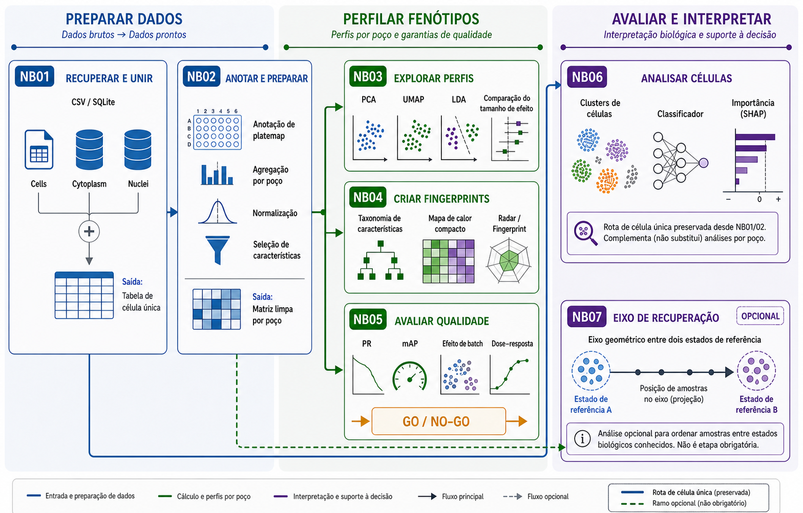

# Pipeline de Live Cell Painting: dos dados aos perfis fenotípicos

## Propósito

Este módulo apresenta os fundamentos científicos e computacionais do pipeline de Live Cell Painting (LCP), conectando a organização do projeto à produção de perfis fenotípicos analisáveis.

A proposta não é repetir comandos ou telas do software. O objetivo é compreender por que cada etapa existe, quais decisões dependem dela e como erros introduzidos no início podem se propagar até a interpretação biológica.

O módulo funciona como uma ponte entre as aulas conceituais sobre Live Cell Painting e o tutorial prático do pipeline completo.

## Perfil de saída

Ao final deste módulo, a pessoa será capaz de:

- relacionar a estrutura do projeto às etapas do pipeline de HCI/HCA;
- distinguir projeto, experimento, dado bruto, dado intermediário e resultado derivado;
- explicar como metadados conectam imagens, placas, poços, sites e condições biológicas;
- compreender como o CellProfiler constrói conjuntos de imagens a partir de `load_data.csv`;
- avaliar a segmentação no AssayDev com atenção a erros ocasionais e sistemáticos;
- distinguir objetos segmentados, features calculadas e perfis fenotípicos;
- explicar como NB01 e NB02 transformam tabelas do CellProfiler em perfis comparáveis;
- reconhecer o papel dos notebooks NB03–NB07 e as diferenças entre análises por poço, de célula única e opcionais;
- separar medição, cálculo, resultado e interpretação biológica.

## Visão geral do pipeline

*O NB01 consolida os compartimentos; o NB02 prepara os perfis; NB03–NB05 exploram e avaliam os perfis por poço; o NB06 preserva a análise de célula única; e o NB07 oferece uma análise opcional do eixo de recuperação.*

## Estrutura do módulo

1. [Organização dos dados](organizacao-dos-dados/index.md): arquitetura do projeto, proveniência, versionamento e preservação.
2. [Criando seu projeto](criando-o-projeto/index.md): template, Cookiecutter, ambiente computacional e reprodutibilidade.
3. [Organização dos metadados](organizacao-dos-metadados/index.md): `load_data.csv`, platemap, barcodes e chaves relacionais.
4. [Metadados no CellProfiler](metadados-no-cellprofiler/index.md): formação dos conjuntos de imagens e propagação da proveniência.
5. [AssayDev e controle de qualidade](assaydev/index.md): desenvolvimento da segmentação e avaliação de erros sistemáticos.
6. [Extração de features](extracao-de-features/index.md): passagem dos objetos segmentados para a matriz de medidas.
7. [Pré-processamento e perfis](preprocessamento/index.md): junção, anotação, agregação, normalização e seleção de features.

## Como usar este módulo

As aulas devem ser estudadas em sequência, pois cada etapa produz entradas ou decisões usadas pela etapa seguinte. Os conceitos também podem ser consultados separadamente durante a execução de um experimento.

!!! tip "Teoria e prática"

    Use estas aulas para compreender as decisões e limitações do pipeline. Para executar os comandos e configurar os programas, acompanhe o [tutorial prático do pipeline completo](../40-tutoriais/lcp_pipeline/index.md).

Antes de iniciar o AssayDev, consulte também o tutorial [Instalar CellProfiler & Cellpose](../40-tutoriais/install_cellprofiler/index.md).
