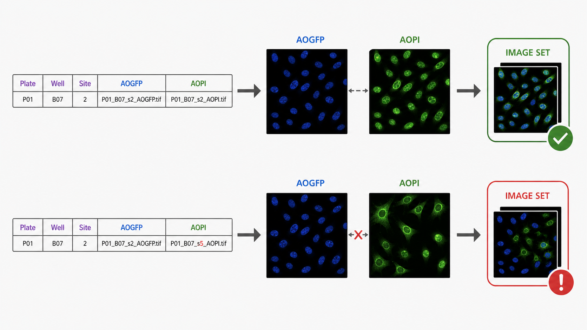

# 04. Entrando com os metadados no CellProfiler

## Objetivos de aprendizagem

Ao final desta aula, você deverá ser capaz de:

- explicar como o CellProfiler transforma linhas de metadados em conjuntos de imagens;
- comparar o módulo `LoadData` com a configuração manual dos módulos de entrada;
- distinguir carregamento, agrupamento e processamento das imagens;
- interpretar as opções de intensidade e localização sem confundi-las com medidas biológicas;
- propor testes para detectar associações incorretas antes da segmentação.

## 1. Da tabela para o pipeline

Na aula anterior, os metadados foram apresentados como a ligação entre arquivos, posições e condições experimentais. No CellProfiler, essa ligação torna-se operacional: cada linha de `load_data.csv` informa quais imagens devem entrar juntas no pipeline e quais identificadores acompanham esse conjunto.

Um **image set** é o conjunto de imagens processado em um mesmo ciclo. Em um ensaio com dois canais, ele pode conter as imagens `AOGFP` e `AOPI` adquiridas na mesma placa, poço e site.

```text
linha de load_data.csv
    → localizar arquivos
    → associar canais
    → anexar Plate, Well e Site
    → formar um image set
    → executar módulos do pipeline
```

Se imagens de sites diferentes forem pareadas, o pipeline poderá segmentar normalmente, mas as relações espaciais entre canais deixarão de ser válidas.



*O `LoadData` usa caminhos e chaves de aquisição para reunir os canais pertencentes à mesma placa, ao mesmo poço e ao mesmo site. Canais de sites diferentes não formam uma unidade espacialmente válida.*

## 2. Duas estratégias de entrada

O CellProfiler oferece módulos como `Images`, `Metadata`, `NamesAndTypes` e `Groups`. Em conjunto, eles localizam arquivos, extraem informações dos nomes, atribuem canais e organizam o processamento.

O módulo `LoadData` recebe essas associações já explicitadas em uma tabela. No fluxo adotado pelo laboratório, ele substitui os quatro módulos iniciais.

| Configuração interna | `LoadData` |
|---|---|
| regras ficam dentro do pipeline | associações ficam em uma tabela inspecionável |
| padrões de nomes são interpretados durante o carregamento | padrões são interpretados na geração do CSV |
| alterações exigem editar o pipeline | alterações podem ser auditadas na tabela |
| pode ser conveniente em fluxos exploratórios | favorece padronização entre experimentos |

`LoadData` não é intrinsecamente imune a erros. Sua vantagem é tornar explícita e versionável a lista de entradas. Se a tabela estiver errada, o erro será reproduzido de forma consistente.

## 3. Caminho, nome e canal

Para cada canal, o CellProfiler precisa saber **onde** está o arquivo e **qual** arquivo deve ser aberto. Por isso, `PathName_AOGFP` e `FileName_AOGFP` têm papéis diferentes.

O rótulo `AOGFP` é um nome lógico usado pelo pipeline. Ele não prova que o conteúdo da imagem corresponde ao marcador esperado. Essa relação deve ser verificada a partir do painel experimental, da configuração de aquisição e da inspeção visual.

Uma mudança de diretório depois da geração da tabela pode invalidar caminhos absolutos. Uma configuração de localização-base pode permitir realocar o conjunto de dados, mas precisa ser testada no computador onde a análise será executada.

## 4. Metadados acompanham as medidas

Campos `Metadata_*` não servem apenas para escolher imagens. Eles são propagados para as saídas e permitem relacionar cada objeto segmentado à placa, ao poço e ao site de origem.

Essa proveniência é necessária para:

- agregar células por poço;
- comparar réplicas;
- investigar efeitos de placa;
- associar condições do platemap;
- retornar de um perfil atípico à imagem original.

Remover uma chave importante nessa etapa pode tornar ambíguas as tabelas de saída. A análise quantitativa não deve depender da posição das linhas ou da ordem em que os arquivos foram processados.

## 5. Agrupar não é o mesmo que anotar

Um metadado pode ser carregado sem ser usado para agrupar o processamento. **Anotar** significa manter uma informação associada ao image set. **Agrupar** significa instruir o CellProfiler a tratar conjuntos relacionados como uma unidade durante a execução.

O agrupamento só é necessário quando algum módulo depende do conjunto completo ou de uma ordem específica. Selecionar `Plate`, `Well` e `Site` sem compreender essa função pode produzir grupos unitários ou uma lógica diferente da pretendida.

A decisão deve partir da necessidade do pipeline, e não da ideia de que mais campos de agrupamento sempre representam maior rigor.

## 6. Escala de intensidade

A opção de reescalonar intensidades durante o carregamento diz respeito à representação numérica usada pelo software. Ela não corrige iluminação desigual, não remove background e não normaliza diferenças biológicas ou de placa.

É preciso separar:

- **reescalonamento de representação:** converte a faixa numérica para a convenção esperada pelo software;
- **correção de iluminação:** modela variações espaciais sistemáticas do campo;
- **normalização de features:** torna medidas comparáveis em uma etapa posterior.

Tratar essas operações como equivalentes pode ocultar a origem de uma transformação e levar a interpretações incorretas.

## 7. Validar com exemplos informativos

Testar apenas a primeira imagem do conjunto é insuficiente. A validação deve incluir image sets capazes de expor falhas:

- diferentes placas ou dias;
- poços de controle e tratamento;
- primeiro e último site;
- campos com baixa e alta densidade celular;
- combinações de canais fáceis de reconhecer visualmente.

O teste deve responder a quatro perguntas:

1. Os arquivos existem e podem ser abertos?
2. Os canais do mesmo image set pertencem à mesma placa, poço e site?
3. Os metadados exibidos correspondem ao arquivo observado?
4. As imagens têm dimensões e escalas compatíveis com o pipeline?

Adicionar temporariamente um módulo simples de identificação pode confirmar que o canal está disponível, mas uma segmentação bem-sucedida não valida, sozinha, o pareamento dos metadados.

## 8. Fechamento

O `LoadData` transforma uma descrição tabular em conjuntos de imagens processáveis e preserva identificadores que acompanharão as medidas. Seu papel é construir a entrada do pipeline; ele não valida a biologia nem a qualidade da segmentação.

### Principais conceitos

- Um image set reúne canais da mesma unidade de aquisição.
- `LoadData` torna explícitas as associações antes configuradas em vários módulos.
- Nome lógico de canal, conteúdo biológico e comprimento de onda são informações relacionadas, mas distintas.
- Metadados devem acompanhar os objetos até as tabelas finais.
- Agrupamento, reescalonamento e normalização são operações diferentes.

### Exercícios

1. Descreva um erro em que `AOGFP` e `AOPI` de sites diferentes são pareados. Quais análises seriam afetadas e como você o detectaria?
2. Explique por que uma segmentação visualmente plausível não prova que os metadados foram carregados corretamente.
3. Compare os efeitos de um caminho de arquivo inválido e de um rótulo de tratamento incorreto. Qual tende a produzir erro explícito?
4. Proponha cinco image sets para testar o carregamento de um experimento com três placas e justifique a seleção.

### Para aprofundar

- Use a seção [Carregando os metadados no CellProfiler](../../40-tutoriais/lcp_pipeline/lcp_pipeline.html#carregando-os-metadados-no-cellprofiler) para configurar e inspecionar o `LoadData`.
- O [tutorial 00 — Instalar CellProfiler & Cellpose](../../40-tutoriais/install_cellprofiler/index.md) descreve a instalação e abertura do programa com o plugin Cellpose.
