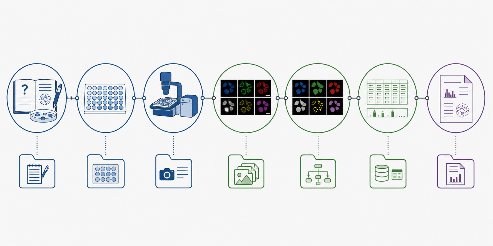

# 01. Organização dos dados

## Objetivos de aprendizagem

Ao final desta aula, você deverá ser capaz de:

- explicar por que a organização dos arquivos faz parte do método científico;
- distinguir projeto, experimento, dado bruto, dado intermediário e resultado;
- relacionar as pastas do projeto às etapas do pipeline de HCI/HCA;
- decidir o que deve ser versionado no GitHub e o que deve ser preservado em um repositório de dados;
- reconhecer situações em que uma estrutura inadequada compromete a rastreabilidade.

## 1. Da imagem ao conhecimento biológico

Um experimento de High Content Imaging (HCI) não termina quando as imagens são adquiridas. As imagens são registros produzidos por um sistema óptico e precisam ser associadas ao desenho experimental, processadas, segmentadas e convertidas em medidas antes que possam sustentar uma interpretação biológica.

O fluxo pode ser representado como uma cadeia:

```text
pergunta biológica
    → desenho experimental
    → aquisição de imagens
    → metadados
    → segmentação
    → extração de features
    → pré-processamento
    → análise quantitativa
    → interpretação biológica
```

A estrutura de arquivos torna essa cadeia visível. Ela registra quais entradas foram usadas, quais operações foram realizadas e quais produtos foram gerados. Quando imagens, pipelines e resultados são armazenados sem uma regra comum, perde-se a capacidade de reconstruir a análise — mesmo que todos os arquivos ainda existam.

Por isso, organizar dados não é apenas uma tarefa administrativa. É uma forma de controlar a proveniência dos dados e reduzir erros.



*A organização do projeto preserva a ligação entre a pergunta experimental, os dados adquiridos, as transformações computacionais e os resultados interpretados.*

## 2. Projeto e experimento são unidades diferentes

Um **projeto** representa uma pergunta científica ampla ou uma linha de investigação. Ele pode reunir vários experimentos realizados ao longo de meses ou anos. No pipeline do laboratório, o repositório criado com o Cookiecutter é essa unidade mais ampla.

Um **experimento** é uma execução concreta, com condições, placas, datas e imagens definidas. Cada experimento recebe um identificador, o `EXPERIMENT_ID`, como:

```text
2025_06_28_Huh7_NPPS_24h
```

Esse identificador aparece nas diferentes partes do projeto. Assim, as imagens, os metadados, o pipeline do CellProfiler e os resultados de uma mesma execução podem ser associados sem depender da memória de quem realizou o trabalho.

O identificador não substitui os metadados. Ele funciona como uma chave de rastreamento, enquanto informações detalhadas — concentração, controle, réplica, poço e site — permanecem em tabelas estruturadas.

## 3. Organização por função

O projeto utiliza uma organização **por módulo funcional**. Em vez de colocar todos os produtos de um experimento dentro de uma única pasta, cada etapa do pipeline possui uma área própria, e o `EXPERIMENT_ID` conecta essas áreas.

```text
<repo_name>/
├── images/
│   └── <EXPERIMENT_ID>/
├── workspace/
│   ├── metadata/<EXPERIMENT_ID>/
│   ├── load_data_csv/<EXPERIMENT_ID>/
│   ├── pipelines/<EXPERIMENT_ID>/
│   ├── assaydev/<EXPERIMENT_ID>/
│   ├── analysis/<EXPERIMENT_ID>/
│   ├── backend/<EXPERIMENT_ID>/
│   ├── profiles/<EXPERIMENT_ID>/
│   └── models/<EXPERIMENT_ID>/
└── workspace_dl/<EXPERIMENT_ID>/
```

Essa escolha favorece automação e comparação. Um programa pode procurar todos os metadados em `workspace/metadata/`, por exemplo, sem precisar conhecer a organização interna de cada pesquisador.

| Pasta | Papel no fluxo | Conteúdo típico |
|---|---|---|
| `images/` | preservar a observação original | imagens brutas e, quando aplicável, dados de iluminação |
| `metadata/` | descrever o desenho experimental | platemaps e associação entre placas e layouts |
| `load_data_csv/` | localizar e parear imagens | tabela usada pelo módulo `LoadData` |
| `pipelines/` | registrar operações de análise | arquivos `.cppipe` do CellProfiler |
| `assaydev/` | documentar o QC da segmentação | contornos, montagens e diagnósticos |
| `backend/` | armazenar medidas em nível de objeto | CSV ou SQLite produzidos pelo CellProfiler |
| `profiles/` | armazenar representações processadas | perfis de célula ou poço e tabelas selecionadas |
| `models/` | preservar modelos ajustados | modelos de segmentação ou classificação |

As pastas não são categorias arbitrárias. Elas representam estados diferentes do dado e responsabilidades diferentes no pipeline.

## 4. Dados brutos, intermediários e derivados

**Dados brutos** são os registros mais próximos da aquisição. No contexto deste módulo, são principalmente as imagens produzidas pelo microscópio. Elas devem ser preservadas sem alterações porque permitem reprocessar o experimento e avaliar limitações da aquisição.

**Dados intermediários** são produtos necessários para continuar o processamento: máscaras, tabelas em nível de célula, bancos SQLite e perfis normalizados. Alguns podem ser regenerados, mas isso só é possível se as entradas, os parâmetros e o software estiverem documentados.

**Resultados derivados** são tabelas resumidas, métricas, modelos e figuras usados para responder à pergunta científica. Eles não substituem os dados anteriores, pois já incorporam escolhas analíticas.

Essa distinção ajuda a definir políticas de armazenamento. Também evita um erro comum: tratar uma figura final como se ela fosse o dado experimental.

## 5. O nome do arquivo não deve carregar todo o experimento

Nomes consistentes facilitam a leitura por pessoas e programas. Datas em ordem ano–mês–dia, ausência de espaços e uso estável de identificadores ajudam a ordenar e localizar arquivos.

Entretanto, não é desejável codificar toda a biologia no nome de cada imagem. Quanto mais informação é repetida em nomes, maior a chance de abreviações conflitantes e erros de digitação. O nome deve identificar o arquivo; os metadados estruturados devem descrever o experimento.

Depois que um arquivo é referenciado por `load_data.csv`, renomeá-lo ou movê-lo pode romper a ligação entre a tabela e a imagem. A estabilidade dos caminhos passa, então, a ser parte da reprodutibilidade computacional.

## 6. Versionamento e preservação não são a mesma coisa

O Git registra mudanças em arquivos leves, como código, pipelines, metadados e documentação. Isso permite saber o que foi alterado, por quem e em qual momento. O GitHub torna esse histórico acessível para colaboração.

Imagens brutas e bancos de célula única podem ser grandes demais para esse tipo de versionamento. Esses arquivos devem ser preservados em infraestrutura apropriada, como o REDU ou outro repositório institucional. O objetivo é manter integridade, acesso e, quando pertinente, um identificador persistente.

| Tipo de material | Destino principal | Justificativa |
|---|---|---|
| código, notebooks e pipelines | Git/GitHub | histórico de alterações e colaboração |
| platemaps e metadados leves | Git/GitHub | documentação do desenho e rastreabilidade |
| imagens brutas | repositório de dados | volume, preservação e compartilhamento |
| bancos de célula única | repositório de dados | volume e possibilidade de reanálise |
| figuras e perfis pequenos | Git/GitHub e/ou repositório | ligação entre análise e comunicação |

Um arquivo estar fora do Git não significa que ele seja descartável. Significa que precisa de outra estratégia de preservação.

## 7. Como a organização previne erros

Considere três placas adquiridas em dias diferentes. Se todas forem chamadas apenas de `Plate_1`, a informação do dia de aquisição pode desaparecer durante a combinação dos dados. Se, ao contrário, cada placa estiver ligada a um identificador persistente e esse identificador for mantido nas tabelas, torna-se possível investigar efeitos de placa ou de lote.

Da mesma forma, salvar um pipeline apenas como `final.cppipe` não informa qual experimento o utilizou nem permite comparar versões. Preservar o pipeline junto ao identificador do experimento estabelece a ligação entre operação e resultado.

A estrutura não elimina erros por si só. Ela cria pontos verificáveis nos quais eles podem ser detectados.

## 8. Fechamento

Em HCI/HCA, centenas de imagens podem produzir milhões de medidas. A organização do projeto é o sistema que mantém essas medidas ligadas à sua origem biológica e experimental. Uma boa arquitetura permite localizar, reproduzir, auditar e compartilhar a análise.

### Principais conceitos

- Projeto e experimento são unidades diferentes.
- O `EXPERIMENT_ID` conecta as etapas, mas não substitui os metadados.
- Dados brutos, intermediários e derivados exigem estratégias distintas.
- GitHub é usado para versionamento; repositórios de dados, para preservação de arquivos pesados.
- Caminhos e nomes tornam-se parte do pipeline quando são referenciados por programas.

### Exercícios

1. Uma estudante armazenou imagens, pipelines e figuras em uma única pasta e sobrescreveu o pipeline após cada ajuste. Quais relações de proveniência foram perdidas? Proponha uma reorganização.
2. Classifique os itens a seguir como dado bruto, intermediário ou resultado derivado: imagem TIFF, máscara de núcleos, banco SQLite do CellProfiler, perfil normalizado por poço e gráfico de PCA.
3. Um arquivo de imagens foi movido depois da geração de `load_data.csv`. Explique por que o CellProfiler pode deixar de encontrá-lo e indique duas formas de prevenir o problema.
4. Proponha um `EXPERIMENT_ID` para um ensaio com células Huh7, tratamento com NPPS, exposição de 48 horas e aquisição em 12 de março de 2026. Quais informações ainda precisariam estar nos metadados?

### Para aprofundar

- Consulte no tutorial prático a [visão geral do fluxo](../../40-tutoriais/lcp_pipeline/lcp_pipeline.html#visão-geral-do-fluxo) e observe como cada produto é encaminhado à etapa seguinte.
- Explore os princípios FAIR e reflita sobre como encontrabilidade, acessibilidade, interoperabilidade e reutilização se aplicam às imagens e aos metadados do seu projeto.
