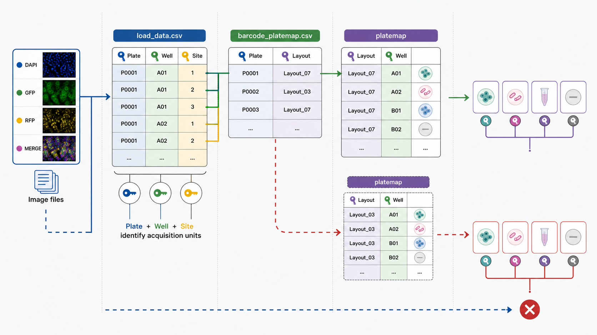

# 03. Organizando os metadados

## Objetivos de aprendizagem

Ao final desta aula, você deverá ser capaz de:

- definir metadados e explicar seu papel em HCI/HCA;
- distinguir metadados de arquivo, aquisição, placa, poço e condição biológica;
- explicar as funções de `load_data.csv`, platemap e `barcode_platemap.csv`;
- reconhecer chaves usadas para relacionar imagens e desenho experimental;
- identificar inconsistências capazes de se propagar para toda a análise.

## 1. Uma imagem sem contexto é uma medida incompleta

Um arquivo TIFF contém valores de intensidade organizados espacialmente. Por si só, ele não informa necessariamente qual tratamento foi aplicado, qual poço foi imageado, a qual réplica pertence ou qual canal representa cada marcador.

Essas informações contextuais são **metadados**: dados que descrevem outros dados. Em HCI/HCA, eles permitem conectar o sinal registrado pelo microscópio ao desenho experimental.

```text
imagem + metadados de aquisição + metadados experimentais
    → unidade analisável e interpretável
```

Se essa conexão estiver errada, a análise pode executar normalmente e ainda assim comparar grupos incorretos. Erros de metadados são especialmente perigosos porque nem sempre produzem mensagens de falha.

## 2. Camadas de metadados

Os metadados de um experimento de imagem podem ser organizados em camadas.

| Camada | Exemplos | Pergunta respondida |
|---|---|---|
| arquivo | nome, caminho, formato | onde está a imagem? |
| aquisição | canal, site, exposição, objetiva | como a imagem foi registrada? |
| placa | barcode, dia, lote | de qual execução ela veio? |
| posição | poço e campo | onde foi adquirida? |
| condição | célula, tratamento, dose, controle | o que foi aplicado? |
| proveniência | programa e versão | como a tabela foi produzida? |

Nem todas essas informações aparecem no mesmo arquivo. O pipeline usa tabelas relacionadas para evitar repetição e conectar cada camada por identificadores comuns.

## 3. As três peças centrais

### 3.1 `load_data.csv`: localizar e parear imagens

O `load_data.csv` descreve os arquivos que serão carregados pelo CellProfiler. Cada linha representa um conjunto de imagens que deve ser processado em conjunto, normalmente correspondendo a uma combinação de placa, poço e site.

Colunas como `FileName_AOGFP` e `PathName_AOGFP` indicam qual arquivo contém um canal e onde ele está. Colunas como `Metadata_Well`, `Metadata_Site` e `Metadata_Plate` identificam a unidade experimental à qual o conjunto pertence.

Assim, o arquivo realiza duas operações conceitualmente diferentes:

1. **localização:** associa nomes de canal a caminhos de imagem;
2. **identificação:** atribui placa, poço e site ao conjunto carregado.

O gerador automatiza essa construção a partir do padrão de nomes produzido pelo sistema de aquisição. Essa automação reduz digitação manual, mas depende de nomes consistentes e de canais corretamente reconhecidos.

### 3.2 Platemap: descrever o conteúdo dos poços

O platemap representa o desenho experimental realizado na placa. Ele associa cada poço a variáveis como modelo celular, tratamento, concentração e papel experimental.

É importante representar a placa **executada**, não apenas a placa planejada. Um poço reservado para ajuste de foco ou exposição pode não ter dados válidos. Marcá-lo como tratamento cria uma condição sem observação correspondente ou, em alguns fluxos, associa imagens inadequadas à análise.

Controles devem ter rótulos explícitos e consistentes, como `negcon` e `poscon`. Esses rótulos são usados posteriormente para normalização, avaliação da separação fenotípica e critérios de Go/No-Go. Uma inconsistência de grafia pode dividir um único grupo em categorias diferentes.

### 3.3 `barcode_platemap.csv`: ligar placa física e desenho

Em experimentos com várias placas ou dias, o nome do layout não é suficiente para identificar a aquisição correspondente. O `barcode_platemap.csv` funciona como uma tabela de associação:

| Assay_Plate_Barcode | Plate_Map_Name |
|---|---|
| `220505_095645_Plate_1` | `layout_day1.txt` |
| `220614_143057_Plate_1` | `layout_day2.txt` |

O barcode identifica a placa nos dados de imagem, enquanto `Plate_Map_Name` indica qual desenho experimental deve ser aplicado. Trocar essa associação pode rotular uma placa inteira com condições incorretas.

## 4. Chaves e relações

Podemos imaginar os metadados como pequenas tabelas relacionadas:

```text
arquivo de imagem
    └── Plate + Well + Site
             │
             ├── barcode_platemap: Plate → Plate_Map_Name
             │
             └── platemap: Plate_Map_Name + Well → condição biológica
```

`Plate`, `Well` e `Site` funcionam como chaves de identificação. Uma chave deve ser estável e suficientemente específica para evitar colisões. `Well=B02` não identifica uma observação de forma única quando existem várias placas; `Plate + Well + Site` normalmente identifica melhor o conjunto de aquisição.

Essa lógica relacional reaparece quando as tabelas de células, núcleos e citoplasmas são combinadas. Compreendê-la agora ajuda a interpretar o pré-processamento mais adiante.



*Os metadados conectam cada arquivo de imagem à placa, ao poço, ao site e à condição experimental por meio de chaves explícitas. Uma associação incorreta pode atribuir a condição biológica errada a uma placa inteira.*

## 5. Vocabulário controlado e tipos de dados

Computadores tratam `Huh7`, `HUH7` e `Huh-7` como valores diferentes. O mesmo ocorre com `NonTreated`, `non-treated` e `Controle`. Um vocabulário controlado reduz a fragmentação acidental de categorias.

Concentrações merecem atenção especial. O valor numérico e a unidade são componentes diferentes da medida. Se a tabela operacional exige apenas o número, a unidade deve estar registrada de forma inequívoca em outro campo de metadados ou na documentação do experimento.

Também é importante distinguir número e texto. Ordenar concentrações armazenadas como texto pode produzir a sequência `1, 10, 100, 2`, o que altera gráficos e análises de dose–resposta.

## 6. Validação antes do CellProfiler

Antes de iniciar a análise, os metadados devem ser examinados como dados científicos. Algumas verificações essenciais são:

- todos os caminhos apontam para arquivos existentes;
- os canais esperados estão presentes para cada conjunto;
- combinações de placa, poço e site não estão duplicadas indevidamente;
- todos os barcodes possuem um platemap correspondente;
- os poços imageados possuem condições válidas;
- poços não utilizados não receberam rótulos experimentais;
- controles, tratamentos e unidades usam convenções consistentes;
- o número de placas e sites concorda com o experimento realizado.

Essas verificações avaliam a estrutura. Elas não demonstram que o tratamento foi aplicado corretamente nem que a imagem possui qualidade suficiente.

## 7. Metadados mínimos e metadados ricos

O pipeline precisa de um conjunto mínimo de campos para localizar imagens e associá-las a condições. Entretanto, a reutilização científica exige contexto adicional: densidade de semeadura, tempo de exposição, composição do painel, parâmetros de aquisição, lotes de reagentes e versões de software podem ser decisivos para interpretar diferenças.

Há, portanto, dois objetivos relacionados:

- **metadados operacionais:** permitem ao pipeline executar;
- **metadados descritivos:** permitem compreender, auditar e reutilizar o experimento.

Um pipeline executar com sucesso prova apenas que seus requisitos operacionais foram atendidos.

## 8. Propagação de erros

Considere um poço de controle positivo rotulado como tratamento. O CellProfiler ainda carregará e medirá as imagens. A normalização poderá usar o grupo errado; as métricas de qualidade avaliarão referências incorretas; e uma visualização poderá sugerir uma separação convincente. O erro inicial se transforma em uma conclusão potencialmente falsa.

Por isso, metadados devem ser tratados com a mesma atenção dada a uma imagem ou a um código de análise. Eles são parte da medição, não uma anotação opcional feita ao final.

## 9. Fechamento

Metadados conectam pixels, posições e condições biológicas. `load_data.csv`, platemap e `barcode_platemap.csv` cumprem funções distintas e complementares: localizar imagens, descrever poços e associar placas físicas aos respectivos desenhos.

### Principais conceitos

- Uma imagem sem contexto experimental não é suficiente para interpretação.
- `load_data.csv` localiza e identifica conjuntos de imagens.
- O platemap descreve o conteúdo realmente executado em cada poço.
- `barcode_platemap.csv` relaciona cada placa ao layout correto.
- Consistência de chaves, rótulos e unidades previne erros silenciosos.
- Metadados operacionais permitem executar; metadados descritivos permitem reutilizar.

### Exercícios

1. Uma placa possui três sites por poço e dois canais. Descreva o que deveria constituir uma linha de `load_data.csv` e quais campos identificariam esse conjunto.
2. Explique por que `Well` sozinho não é uma chave suficiente em um experimento com três placas.
3. Um platemap contém `DMSO`, `dmso` e `Vehicle` para o mesmo tipo de controle. Quais efeitos isso pode causar na agregação e na normalização?
4. Construa uma cadeia de propagação para o caso em que `layout_day1.txt` é associado por engano à placa do dia 2.
5. Diferencie metadados operacionais e descritivos e dê três exemplos de cada categoria.

### Para aprofundar

- No tutorial prático, examine a seção [Preparando os metadados](../../40-tutoriais/lcp_pipeline/lcp_pipeline.html#preparando-os-metadados) e identifique qual chave conecta cada arquivo ao seguinte.
- Abra um `load_data.csv` real e teste se `Plate + Well + Site` identifica cada linha de maneira única.
