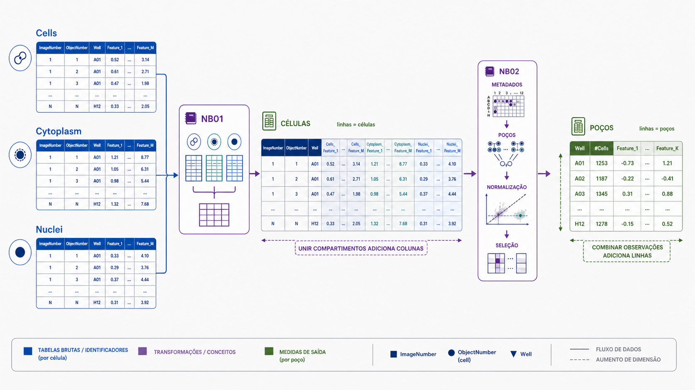

# 07. Pré-processamento

## Objetivos de aprendizagem

Ao final desta aula, você deverá ser capaz de:

- explicar por que as tabelas do CellProfiler não estão prontas para análise direta;
- distinguir junção, anotação, agregação, normalização e seleção de features;
- explicar a diferença entre dados de célula única e perfis por poço;
- identificar riscos de perda de proveniência, vazamento de dados e efeito de lote;
- interpretar o pré-processamento como parte da definição do resultado.

## 1. A matriz bruta não é o resultado final

O CellProfiler produz medidas por objeto e por compartimento. Essas tabelas contêm informação valiosa, mas também redundância, escalas incompatíveis, valores extremos, medidas de baixa qualidade e efeitos técnicos.

O **pré-processamento** transforma essas saídas em representações adequadas às perguntas seguintes. Ele não é uma limpeza neutra: cada escolha altera quais padrões ficam visíveis e como as observações podem ser comparadas.

```text
tabelas por compartimento
    → junção e anotação
    → QC estrutural
    → agregação
    → normalização
    → seleção de features
    → perfis analisáveis
```

No pipeline atual, essas operações são executadas principalmente pelos notebooks NB01 e NB02, antes das visualizações e métricas posteriores.



*O pré-processamento combina compartimentos, preserva metadados, altera a unidade de observação por agregação e produz perfis por poço comparáveis.*

## 2. Junção dos compartimentos

`Cells`, `Cytoplasm` e `Nuclei` podem possuir colunas com o mesmo nome, como `AreaShape_Area`. Prefixar a feature pelo compartimento preserva sua origem:

| Feature original | Nome após prefixação |
|---|---|
| `AreaShape_Area` em Cells | `Cells_AreaShape_Area` |
| `AreaShape_Area` em Cytoplasm | `Cytoplasm_AreaShape_Area` |
| `AreaShape_Area` em Nuclei | `Nuclei_AreaShape_Area` |

Em seguida, as tabelas são unidas pelas chaves que identificam objetos relacionados. Essa operação adiciona **colunas** ao perfil da célula. Já combinar placas ou campos adiciona **linhas**.

Confundir essas operações pode gerar duplicação cartesiana: uma célula é combinada com vários núcleos ou várias linhas equivalentes. A contagem de linhas antes e depois da junção é uma verificação estrutural simples e poderosa.

## 3. Anotação com o desenho experimental

Os perfis celulares precisam receber as condições descritas pelo platemap. Essa associação usa placa e poço, mantendo também site e identificadores de objeto.

Anotar não significa modificar as features. Significa acrescentar contexto para que cada linha possa ser agrupada e comparada. Uma célula sem metadados de condição pode continuar presente na tabela, mas não pertence de forma inequívoca a nenhum grupo experimental.

Após a anotação, deve-se verificar se todos os poços encontraram correspondência e se os tamanhos dos grupos concordam com o desenho planejado e executado.

## 4. Célula única e perfil por poço

Dados em nível de célula preservam heterogeneidade. Eles permitem estudar subpopulações, distribuições e fenótipos raros, mas suas linhas não são necessariamente réplicas independentes. Mil células do mesmo poço compartilham aquisição, tratamento e microambiente.

Agregar células por poço produz uma unidade mais próxima da réplica experimental. A mediana é frequentemente usada por ser menos sensível a valores extremos, embora a escolha dependa da distribuição e da pergunta.

| Nível | Unidade da linha | Vantagem | Limitação |
|---|---|---|---|
| célula única | objeto segmentado | preserva heterogeneidade | pseudorreplicação e grande volume |
| poço | resumo das células | respeita melhor o desenho | oculta subpopulações |
| tratamento | resumo de poços | facilita comunicação | pode ocultar variação entre réplicas |

Agregação é uma decisão inferencial. Ela define qual variação será preservada e qual será resumida.

## 5. Normalização

Features diferentes possuem escalas e distribuições distintas. Área pode assumir centenas de pixels; uma correlação de textura pode variar em uma faixa muito menor. Sem normalização, métodos baseados em distância podem ser dominados pelas maiores escalas numéricas.

Uma estratégia robusta comum centraliza e escala cada feature usando uma população de referência, frequentemente controles negativos:

```text
valor normalizado
≈ (valor − mediana da referência) / dispersão robusta da referência
```

Intuitivamente, o valor passa a expressar quanto uma observação difere do comportamento típico do grupo de referência. A transformação não remove automaticamente efeitos de lote nem torna placas incompatíveis comparáveis.

A referência deve ser escolhida antes de olhar o resultado desejado. Normalizar usando todo o conjunto pode incorporar tratamentos fortes ao centro e à escala. Ajustar parâmetros com dados de teste também pode causar vazamento em análises preditivas.

## 6. Seleção de features

Algumas features devem ser removidas ou reduzidas porque não contribuem com informação estável:

- colunas de metadados não numéricas usadas como se fossem medidas;
- features com variância muito baixa;
- colunas com excesso de valores ausentes ou infinitos;
- pares altamente correlacionados;
- medidas conhecidas por refletir falhas técnicas;
- features que não podem ser comparadas entre placas por mudança de configuração.

Correlação alta indica redundância estatística, não equivalência biológica. A seleção precisa preservar a origem das medidas e ser aplicada sem usar rótulos de avaliação de maneira indevida.

Reduzir a dimensionalidade nesse ponto não é o mesmo que executar PCA ou UMAP. Seleção remove ou retém colunas; métodos de redução constroem novas coordenadas a partir delas.

## 7. Efeitos técnicos e biológicos

O resultado observado pode ser pensado conceitualmente como:

```text
resultado observado
≈ efeito biológico
+ efeito do tratamento
+ efeito técnico
+ erro aleatório
```

Placa, dia, posição, densidade, tempo de aquisição e intensidade de iluminação podem introduzir estrutura nos perfis. Se uma condição foi colocada apenas em uma placa, tratamento e placa ficam confundidos: nenhuma correção computacional consegue separar completamente os dois efeitos sem informação adicional.

O pré-processamento pode reduzir certos efeitos técnicos, mas não corrige um desenho experimental incapaz de identificá-los.

## 8. Controle de qualidade estrutural

Antes de interpretar PCA, UMAP ou classificadores, é necessário verificar:

- unicidade e integridade das chaves;
- número de placas, poços, sites e células;
- correspondência com o platemap;
- taxas de valores ausentes e infinitos;
- distribuição do número de células por poço;
- features removidas em cada filtro;
- equilíbrio de controles entre placas;
- presença de efeitos técnicos evidentes.

Essas verificações devem gerar registros, não apenas inspeção momentânea. O pipeline atual organiza checagens sucessivas para impedir que uma etapa avance silenciosamente com uma entrada estruturalmente inválida.

## 9. Arquivos intermediários e contratos entre etapas

O NB01 consolida as tabelas do CellProfiler em `single_cell_profiles.parquet`. O NB02 anota, agrega, normaliza e seleciona features, produzindo `per_well_features_selected.parquet` e dados preparados para análises de célula única.

Cada arquivo funciona como um **contrato**: possui uma unidade de observação, um conjunto de chaves e uma expectativa sobre as colunas. Saber apenas o nome do arquivo não é suficiente; é preciso conhecer:

- o que cada linha representa;
- quais operações já foram aplicadas;
- quais metadados foram preservados;
- qual versão do pipeline o gerou.

O formato Parquet preserva tipos e é eficiente para tabelas grandes, mas não garante qualidade ou significado por si só.

## 10. O que o pré-processamento permite concluir?

Após o pré-processamento, os dados estão mais adequados para comparar perfis, avaliar replicabilidade e explorar estrutura fenotípica. Ainda assim, uma separação em PCA ou UMAP não demonstra mecanismo nem causalidade.

Se perfis tratados se afastam dos controles, o resultado indica uma perturbação nas features medidas, condicionada ao painel, à segmentação e ao pré-processamento. A interpretação biológica deve considerar controles, reprodutibilidade, magnitude, efeitos técnicos e evidências ortogonais.

## 11. Fechamento

Pré-processar é definir como medidas celulares serão transformadas em perfis comparáveis. Junção, anotação, agregação, normalização e seleção respondem a problemas distintos. Quando essas operações são confundidas ou ocultadas, torna-se difícil saber se um padrão é biológico ou produzido pelo próprio pipeline.

### Principais conceitos

- Tabelas do CellProfiler ainda não são perfis prontos para interpretação.
- Prefixos preservam o compartimento de origem das features.
- Células do mesmo poço não devem ser tratadas automaticamente como réplicas independentes.
- Normalização depende de uma referência e não elimina todo efeito de lote.
- Seleção de features controla qualidade e redundância, mas também modifica a representação.
- Arquivos intermediários precisam de unidade, chaves e proveniência documentadas.

### Exercícios

1. Uma junção entre `Cells` e `Nuclei` duplicou o número de linhas. Qual erro provavelmente ocorreu e como você o investigaria?
2. Explique por que comparar 10.000 células tratadas com 10.000 células controle usando cada célula como réplica pode produzir pseudorreplicação.
3. Um tratamento aparece apenas na placa 2. É possível distinguir efeito do tratamento e efeito de placa? Justifique.
4. Compare normalizar pelas medianas dos controles negativos e normalizar por todas as amostras. Em que situação os resultados podem divergir?
5. Um UMAP mostra dois grupos visualmente separados. Escreva uma interpretação proporcional à evidência e liste quatro verificações necessárias.

### Para aprofundar

- No tutorial prático, acompanhe [Do CellProfiler ao pipeline de análise](../../40-tutoriais/lcp_pipeline/lcp_pipeline.html#do-cellprofiler-ao-pipeline-de-análise), o [ambiente Pixi e os notebooks marimo](../../40-tutoriais/lcp_pipeline/lcp_pipeline.html#ambiente-pixi-e-notebooks-marimo) e o percurso [NB01 → NB07](../../40-tutoriais/lcp_pipeline/lcp_pipeline.html#percorrendo-o-pipeline-nb01-nb07).
- Antes de executar NB03–NB07, descreva por escrito a unidade de observação e as transformações presentes em cada arquivo de entrada.
