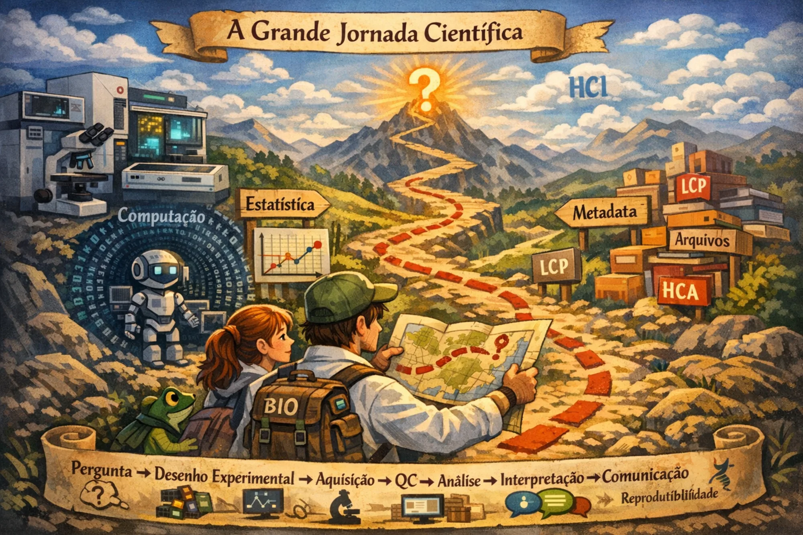

# Curso de High-Content Imaging e High-Content Analysis

Este projeto reúne uma trilha integrada de formação em **High-Content Imaging** e **High-Content Analysis** (HCI/HCA), conectando pergunta científica, desenho experimental, cultura celular, microscopia, análise de imagens e interpretação de dados.

O material foi desenvolvido para apoiar a formação de pós-graduandos e pesquisadores que desejam planejar, executar e analisar experimentos de HCI/HCA com rigor, pensamento crítico e reprodutibilidade.

!!! info "Sobre este material"
    Este material foi desenvolvido a partir das necessidades de treinamento do nosso laboratório, que utiliza o *Live Cell Painting* como um dos principais modelos para integrar cultura celular, microscopia, análise de imagens e perfilamento fenotípico. Apesar desse contexto, os conceitos e práticas apresentados são aplicáveis a diferentes ensaios e projetos de HCI/HCA.

    O conteúdo está em desenvolvimento contínuo. Se você encontrar algum erro, inconsistência ou tiver sugestões de melhoria, fique à vontade para abrir uma *issue* no repositório. Se preferir tratar algo de forma privada, envie um e-mail.

## Visão geral da jornada

O curso acompanha o ciclo completo de um projeto de HCI/HCA:

**Pergunta → desenho experimental → preparação biológica → aquisição → controle de qualidade → análise → interpretação → comunicação → reprodutibilidade**

Embora os módulos possam ser consultados individualmente, o curso foi organizado como uma jornada progressiva. A sequência parte da formulação da pergunta científica e da preparação experimental, passa pela formação e análise das imagens e chega à interpretação de perfis fenotípicos e à construção de fluxos reprodutíveis.

## Estrutura do curso

### 0. [Onboarding](00-onboarding/index.md)

Apresenta os fundamentos conceituais e operacionais necessários para planejar projetos de HCI/HCA com rigor, incluindo pergunta científica, desenho experimental, *batch effects*, Git e organização do trabalho.

### 1. [Microscopia e aquisição](10-microscopia-e-aquisicao/index.md)

Discute como as imagens são formadas e como resolução, fluorescência, sinal, *background*, saturação e parâmetros de aquisição afetam os dados produzidos pelo experimento.

### 2. [Imagem digital e análise](11-imagem-digital-e-analise/index.md)

Mostra como uma imagem se torna dado quantitativo, passando por pixels, intensidades, canais, profundidade de bits, ruído e transformação da imagem em tabelas de medidas.

### 3. [Fundamentos computacionais para análise de imagens](12-fundamentos-computacionais-analise-imagens/index.md)

Introduz ambientes computacionais, dados tabulares, leitura de código em Python e estratégias de validação necessárias para compreender e executar pipelines de análise.

### 4. [Cultura celular e saúde celular](20-cultura-celular-e-cell-health/index.md)

Apresenta princípios de qualidade da cultura celular, desenho de ensaios, controles experimentais e avaliação de respostas celulares letais, subletais e citostáticas.

### 5. [Treinamento em cultura celular](21-treinamento-cultura-celular/index.md)

Organiza a formação prática em cultura celular, desde assepsia, observação e passagens até contagem, plaqueamento, curvas dose–resposta e documentação experimental.

### 6. [Ensaios de HCA](30-ensaios-de-hca/index.md)

Apresenta ensaios multiparamétricos, como *Cell Painting* e *Live Cell Painting*, integrando fundamentos biológicos, execução experimental, aquisição e análise de imagens.

### 7. [Tutoriais](40-tutoriais/index.md)

Reúne guias práticos para instalação de ferramentas, configuração do ambiente computacional e execução de análises e visualizações utilizadas ao longo do curso.

## Por onde começar

Se esta é a sua primeira vez no curso, comece pelo [Onboarding](00-onboarding/index.md) e avance pelos módulos na ordem apresentada.

Se você já possui experiência em alguma das áreas, também pode usar o site como material de consulta e acessar diretamente o módulo relacionado à sua necessidade.

Use o menu lateral para navegar pelas aulas e a busca do site para localizar conceitos, ferramentas, protocolos e etapas específicas do pipeline.

!!! info "Sobre este material"
    Este material foi criado inicialmente para apoiar o treinamento do nosso grupo de pesquisa em HCI/HCA, mas pode ser útil para outras pessoas que estejam aprendendo ou estruturando fluxos semelhantes.

    O conteúdo está em desenvolvimento contínuo. Se você encontrar algum erro, inconsistência ou tiver sugestões de melhoria, fique à vontade para abrir uma *issue* no repositório. Se preferir tratar algo de forma privada, envie um e-mail.
